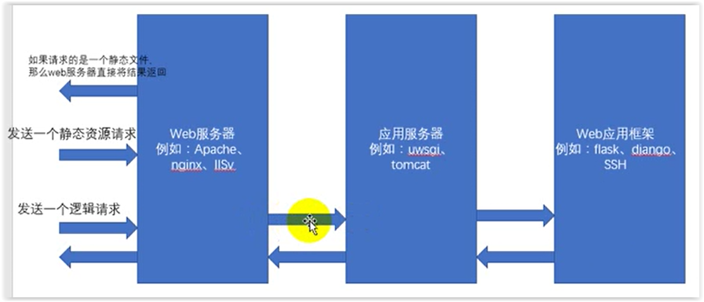

# 03 web服务器+应用服务器+web应用框架

_.web服务器_:负责处理http请求，响应静态文件，常见的由Apache，Nginx以为微软的IIS

_.应用服务器_:负责处理逻辑的服务器。比如php,python的代码，是不能通过nginx这种服务器来处理的，只能通过应用服务器来处理，常见的应用服务器有uwsgi，Tomact等

.web应用框架:一般使用某语言，封装了常用的web功能的框架就是web应用框架，flask，django以及java中的ssh\(Structs2+Spring3+Hibernate3\)框架都是web应用框架

