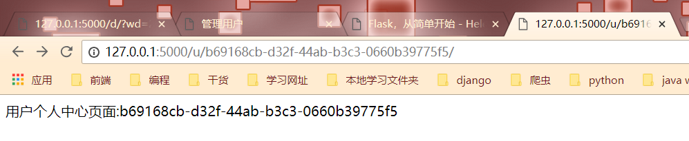
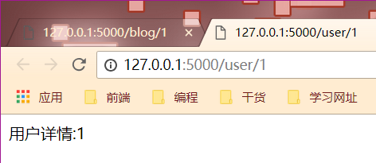
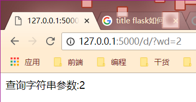

# 07  URL中两种方式传参

## URL与视图函数的映射

### 传递参数

传递参数的语法是:"/&lt;参数名&gt;/",然后在视图函数中，也要定义同名的参数

&lt;converter:variable\_name&gt;,其中converter就是类型名称

string:默认的数据类型，接受没有任何斜杠"\/"的文本

int:接受整型

float:接受浮点类型

path:和string的类似，但是接受斜杠

uuid:只接受uuid字符串\(唯一,长度过长\)。'uuid'只能接受符合'uuid'的字符擦混,'uuid'是一个唯一的字符串，用于做表的主键

```text
import uuid
print(uuid.uuid4())

@app.route('/u/<uuid:user_id>/')
def user_detail(user_id):
    return "用户个人中心页面:%s" % user_id
```



any:可以指定多种路径。'any'数据类型可以在一个"url"中的指定多个路径

通过一个例子来进行说明

```text
from flask import Flask, config

app = Flask(__name__)

@app.route('/<any(blog,user):url_path>/<id>')
def detail(url_path,id):
    if url_path == "blog":
        return "博客详情:%s" % id
    else:
        return "用户详情:%s" % id

if __name__ == '__main__':
    app.run(debug=True)
```




## 接收用户传递的参数

1. 第一种:使用path的形式\(将参数嵌入到路径中\)
2. 第二种:使用查询字符串的方式，就是通过"?key=value"的形式传递的

```text
@app.route('/d/')
def d():
    wd = request.args.get("wd")
    return "查询字符串参数:%s" % wd
```



3.如果页面要做"SEO"优化,推荐使用"path"形式

如果不在搜索引擎优化，就是用查询字符串

```text
from flask import Flask,request

app = Flask(__name__)


@app.route('/')
def hello_world():
    return 'Hello World!'

@app.route('/list/')
def article_list():
    return 'article_list'

# @app.route('/article/<article_id>/')
# def article_detail(article_id):
#     return 'successful，位置%s' % article_id

# @app.route('/p/<int:article_id>')
@app.route('/p/<float:article_id>')
def article_detail(article_id):
    return 'successful，位置%s' % article_id

# @app.route('/article/test/')
# @app.route('/article/<string:test>/')
@app.route('/article/<path:test>/')
def test_article(test):
    return 'test_article %s' % test

@app.route('/u/<uuid:user_id>/')
def user_detail(user_id):
    return '用户个人中心页面:%s' % user_id

# /blog/<id>/
# /user/<id>/
@app.route('/<any(blog,user):url_path>/<id>/')
def detail(url_path,id):
    if url_path == 'blog':
        return '博客详情：%s' % id
    else:
        return '用户详情:%s' % id

# 通过问好的形式传递参数
@app.route('/d/')
def d():
    wd = request.args.get('wd')
    ie = request.args.get('ie')
    print(wd,id,end='')
    return '查询字符串参数:%s %s' % (wd,ie)

# import uuid
# print(uuid.uuid4())

if __name__ == '__main__':
    app.run(debug=True)
```


