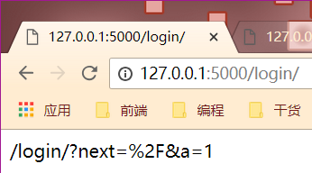

# 08 url\_for使用详解

## url\_for笔记

### 'url\_for'的基本使用

'url\_for'第一个参数，应该是视图函数的名字的字符串，后面的参数就是传递给'url',如果传递的参数之前在'url'中定义了，那么这个参数就会被当成"path"的形式给'url'。如果这个参数之前没有在'url'中定义，那么将变成查询字符串的形式放到'url'中。

```text
@app.route("/post/list/<page>/")
def my_list(page):
    # return "my list"
    print(page)
    return url_for("my_list",page=page,count=2)
```


## 为什么需要url\_for

1. 更方便地获取url地址，如果url函数名被改变了，也不会到处去修改
2. 'url\_for'会自动的处理那些特殊的字符，不需要手动去处理

```text
@app.route('/login/')
def login():
    # return "login"
    # 会自动编码，十六进制
    return url_for('login',next="/",a=1)
```



_tips:在使用url的时候，使用'url\_for'来反转url_

