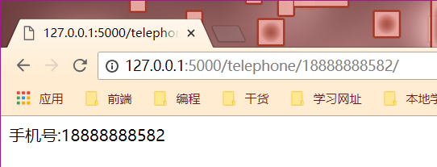
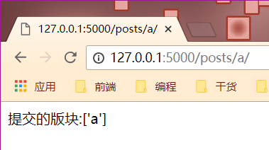
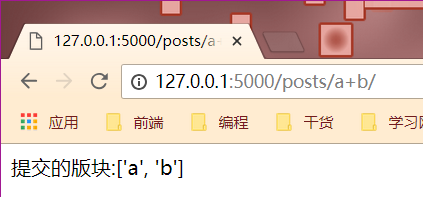

# 09 自定义URL转换器

## 自定义URL转换器的方式

1. 实现一个类，继承自"BaseConverter"
2. 在自定义的类中，重写"regex"，也就是这个变量的正则表达式
3. 将自定义的类，映射到"app.url\_map.Converters",比如:

```text
from flask import Flask, url_for
from werkzeug.routing import BaseConverter

app = Flask(__name__)

# 一个url中，含有手机号码的变量，必须限定这个变量的字符串格式满足手机号码的格式
class TelephoneConveter(BaseConverter):
    regex = r"1[85734]\d{9}"

# 用户访问/post/a+b/
class ListConverter(BaseException):
    def to_python(self,value):
        return "hello"

    def to_url(self,value):
        return "hello"

app.url_map.converters["te1"] = TelephoneConveter
app.url_map.converters["te2"] = ListConverter

@app.route('/telephone/<te1:my_tel>/')
def my_tel(my_tel):
    return "手机号:%s" % my_tel

if __name__ == '__main__':
    app.run(debug=True)
```



### ’to\_python‘的作用:这个方法的返回值，将会传递到view函数中作为参数

### 'to\_url'的作用:这个方法的返回值，将会在调用url\_for函数的时候生成符合要求的URL形式

url\_for\(函数,bords=\['a','a1'\]\)

bords参数:能够将参数传到to\_url中，然后返回

```text
@app.route('/')
def hello_world():
    print(url_for('posts',bords=['a','b']))
    return 'Hello World!'
```


```text
from flask import Flask, url_for
from werkzeug.routing import BaseConverter

app = Flask(__name__)

class TelephoneConveter(BaseConverter):
    regex = r"1[85734]\d{9}"

# 用户访问/post/a+b/
class ListConverter(BaseConverter):
    def to_python(self,value):
        # return "hello"
        return value.split('+')

    def to_url(self,value):
        print(value)
        return "+".join(value)
        # return 'hello'

app.url_map.converters["te1"] = TelephoneConveter
app.url_map.converters['list'] = ListConverter

# @app.route('/telephone/<te1:my_tel>/')
# def my_tel(my_tel):
#     return "手机号:%s" % my_tel
#
# @app.route('/')
# def hello_world():
#     print(url_for('posts',bords=['a','b']))
#     return 'Hello World!'

@app.route('/user/<int:user_id>/')
def user_profile(user_id):
    print("用户id：%s" % user_id)
    return "用户id：%s" % user_id

@app.route('/posts/<list:bords>/')
def posts(bords):
    # bords = bords.split('+')
    print(bords)
    return "提交的版块:%s" % bords

if __name__ == '__main__':
    app.run(debug=True)
```





