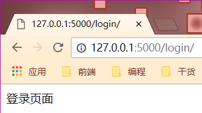

# 11 重定向详解

重定向分为永久性重定向和暂时性重定向，在页面上体现的操作就是浏览器会重一个页面自动跳转另外一个页面，比如用户访问了一个需要权限的页面，但是该用户当前并没有登录，因此我们给它重定向到登录页面

_永久性重定向_:\_http的状态码是301，多用于旧网址就废弃了要转到一个新的网址确保用户的访问www.jingdong.com ---&gt; www.jd.com

_暂时性重定向_:http的状态码是302，表示页面的暂时性跳转。比如访问一个需要权限的网址，如果用户没有登录，应该重定向到登录页面，这种情况下，应该用暂时性重定向

在flask中，重定向是通过flask.redirect\(location,code=302\)这个函数来实现，location表示需要重定向的url，应该配合之前将的url\_for\(\)函数来使用，code表示采用那个重定向，默认是302即暂时性重定向，可以修改成301来实现永久性重定向

## 重定向函数redirect\(location,code=\)

```text
from flask import Flask, url_for, request, redirect

app = Flask(__name__)

@app.route("/login/")
def login_one():
    return "登录页面"

@app.route("/profile/")
def profile():
   if request.args.get("name"):
       return "个人中心页面"
   else:
       print(url_for("login_one"))
       return redirect(url_for("login_one"))

if __name__ == '__main__':
    app.run(debug=True)
```



