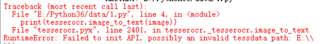

# 1.3.4 tesserocr的安装

## 1.相关链接 {#2-相关链接}

* Tesserocr GitHub：[https://github.com/sirfz/tesserocr](https://github.com/sirfz/tesserocr)
* Tesserocr PyPi：[https://pypi.python.org/pypi/tesserocr](https://pypi.python.org/pypi/tesserocr)
* Tesseract下载地址：[http://digi.bib.uni-mannheim.de/tesseract](http://digi.bib.uni-mannheim.de/tesseract)
* Tesseract GitHub：[https://github.com/tesseract-ocr/tesseract](https://github.com/tesseract-ocr/tesseract)
* Tesseract 语言包：[https://github.com/tesseract-ocr/tessdata](https://github.com/tesseract-ocr/tessdata)
* Tesseract 文档：[https://github.com/tesseract-ocr/tesseract/wiki/Documentation](https://github.com/tesseract-ocr/tesseract/wiki/Documentation)
* Tesseract wheel:[https://github.com/simonflueckiger/tesserocr-windows\_build/releases](https://github.com/simonflueckiger/tesserocr-windows_build/releases)

## 2.windows下安装


其中文件名中带有 dev 的为开发版本，不带 dev 的为稳定版本，可以选择下载不带 dev 的最新版本，例如可以选择下载 tesseract-ocr-setup-3.05.01.exe。

接下来安装Tesserocr，直接使用pip 安装

```text
pip3 install tesserocr pillow
```

如果tesserocr安装报错

需要使用whl安装，并且需要安装Microsoft Visual C++ 14.0.exe

[下载地址](https://pan.baidu.com/s/1lL3WVCE2T-4zQJbjloP6-w)

```text
首先切换到有whl的目录

然后通过pip安装
pip install tesserocr-2.2.2-cp36-cp36m-win_amd64.whl

在这之前需要安装Microsoft Visual C++ 14.0.exe
```

## 3.Linux下的安装 {#4-linux下的安装}

对于 Linux 来说，不同系统已经有了不同的发行包了，它可能叫做 tesseract-ocr 或者 tesseract，直接用对应的命令安装即可。

### Ubuntu、Debian、Deepin {#ubuntu、debian、deepin}

安装命令如下：

```text
sudo apt-get install -y tesseract-ocr libtesseract-dev libleptonica-dev
```

### CentOS、RedHat {#centos、redhat}

安装命令如下：

```text
yum install -y tesseract
```

不同发行版本运行如上命令即可完成 Tesseract 的安装。

安装完成之后便可以调用 tesseract 命令了。

我们查看一下其支持的语言：

```text
tesseract --list-langs
```

运行结果示例：

```text
List of available languages (3):
eng
osd
equ
```

结果显示其只支持几种语言，如果我们想要安装多国语言还需要安装语言包，官方叫做 tessdata。

tessdata 的下载链接为：[https://github.com/tesseract-ocr/tessdata](https://github.com/tesseract-ocr/tessdata)。

利用 Git 命令将其下载下来并迁移到相关目录即可，不同的版本迁移命令如下：

### Ubuntu、Debian、Deepin {#ubuntu、debian、deepin}

```text
git clone https://github.com/tesseract-ocr/tessdata.git
sudo mv tessdata/* /usr/share/tesseract-ocr/tessdata
```

### CentOS、RedHat {#centos、redhat}

```text
git clone https://github.com/tesseract-ocr/tessdata.git
sudo mv tessdata/* /usr/share/tesseract/tessdata
```

这样就可以将下载下来的语言包全部安装了。

这时我们重新运行列出所有语言的命令：

```text
tesseract --list-langs
```

结果如下：

```text
List of available languages (107):
afr
amh
ara
asm
aze
aze_cyrl
bel
ben
bod
bos
bul
cat
ceb
ces
chi_sim
chi_tra
...
```

即可发现其列出的语言就多了非常多，比如 chi\_sim 就代表简体中文，这就证明语言包安装成功了。

接下来再安装 Tesserocr 即可，直接使用 Pip 安装：

```text
pip3 install tesserocr pillow
```

## 4. Mac下的安装 {#5-mac下的安装}

Mac 下首先使用 Homebrew 安装 Imagemagick 和 Tesseract 库：

```text
brew install imagemagick 
brew install tesseract --all-languages
```

接下来再安装 Tesserocr 即可：

```text
pip3 install tesserocr pillow
```

这样便完成了 Tesserocr 的安装。

## 5.验证安装

分别测试Tesseract 和 Tesserocr

[测试图片](https://raw.githubusercontent.com/Python3WebSpider/TestTess/master/image.png)：


用Tesseract 命令行测试，命令如下：

```text
tesseract image.png result -l eng && type result.txt
```

运行结果:

```text
Tesseract Open Source OCR Engine v3.05.01 with Leptonica
Python3WebSpider
```

需要注意:

* 需要将Tesseract-OCR目录配置到环境变量中
* 需要将Tesseract-OCR目录下的tessdata目录配置到环境变量中

tesseract 命令参数讲解:

第一个参数为图片名称，第二个参数 result 为结果保存的目标文件名称，-l 指定使用的语言包，在此使用 eng 英文，然后再用 type命令将结果输出。

然后利用python代码进行测试，需要借助Tesserocr库，测试代码如下:

```text
import tesserocr
from PIL import Image
image = Image.open("D:/image.png")
print(tesserocr.image_to_text(image))
```

如果报错，错误方式如下:



需要将Tesseract-OCR目录下的tessdata目录拷贝到python36目录下

这时重新运行就会成功


在这里首先利用 Image 读取了图片文件，然后调用了 tesserocr 的 image\_to\_text\(\) 方法，再将将其识别结果输出。

运行结果：

```text
Python3WebSpider
```

另外我们还可以直接调用 file\_to\_text\(\) 方法，也可以达到同样的效果：

```text
import tesserocr
print(tesserocr.file_to_text("D:\image.png"))
```

运行结果：

```text
Python3WebSpider
```

如果成功输出结果，则证明Tesseract和Tesserocr都已经安装成功

### 6.pytesseract库

pytesseract库和tesserocr库的效果一样，都可以识别图片，都是用的Tesseract-OCR来进行识别图片的，如果安装不成功就不要纠结tesserocr库了

```
>>> import pytesseract
>>> from PIL import Image
>>>
>>> image = Image.open('image.png')
>>> code = pytesseract.image_to_string(image)
>>> print(code)
Python3WebSpider
```


