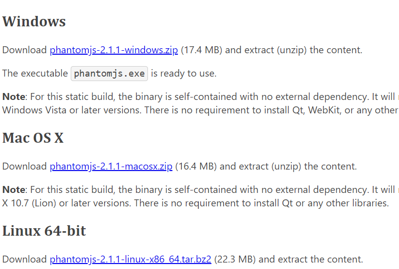

# 1.2.5 PhantomJS的安装

PhantomJS是一个无界面的浏览器.

selenium支持PhantomJS，这样在运行的时候就不会弹出一个浏览器

## 1.相关链接

* 官网网站:[http://phantomjs.org/](http://phantomjs.org/)
* 官方文档：[http://phantomjs.org/quick-start.html](http://phantomjs.org/quick-start.html)
* 下载地址：[http://phantomjs.org/download.html](http://phantomjs.org/download.html)
* API接口说明：[http://phantomjs.org/api/command-line.html](http://phantomjs.org/api/command-line.html)

## 2.下载PhantomJS

配置环境和前面一样

## 3.验证安装

在命令行下输入PhantomJS命令进行验证有类似结果输出就代表配置环境成功


然后在程序中测试

```text
from selenium import webdriver
browser = webdriver.PhantomJS()
browser.get('https://www.baidu.com')
print(browser.current_url)
```

运行后会发现没有浏览器打开，但实际上phantomjs已经运行起来了这里访问了百度，如果将当前url打印出来了就代表PhantomJS配置成功了

