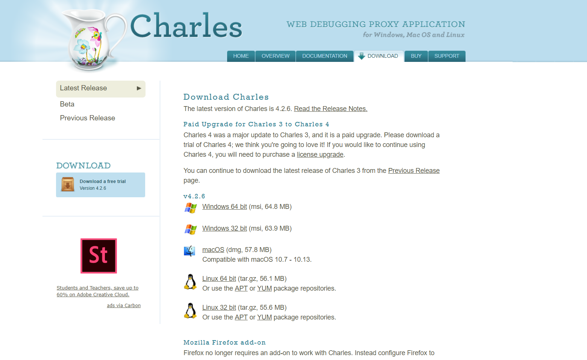

# 1.7.1 Charles的安装

## 1. 相关链接

* 官方网站：[https://www.charlesproxy.com](https://www.charlesproxy.com/)
* 下载链接：[https://www.charlesproxy.com/download](https://www.charlesproxy.com/download)

## 2.下载

[下载Charles](https://www.charlesproxy.com/download/)

## 3.证书配置

Charles是运行在PC端的，由于要抓取的是APP端的数据，需要在PC和手机端都安装证书

### Windows {#windows}

如果你的 PC 是 Windows 系统，可以按照下面的操作进行证书配置。

首先我们先打开 Charles，点击 Help-&gt;SSL Proxying-&gt;Install Charles Root Certificate，即可进入证书的安装页面，如图 1-44 所示：

图 1-44 证书安装页面入口

接下来会弹出一个安装证书的页面，如图 1-45 所示：

图 1-45 证书安装页面

点击安装证书，接下来就会打开证书导入向导，如图 1-46 所示：

图 1-46 证书导入向导

直接点击下一步，接下来需要选择证书的存储区域，点击第二个选项“将所有证书放入下列存储”，然后点击浏览，再选择证书存储位置为“受信任的根证书颁发机构”，确定，点击下一步，如图 1-47 所示：

图 1-47 选择证书存储区域

再继续点击下一步完成导入即可，这样。

### Mac {#mac}

如果你的 PC 是 Mac 系统，可以按照下面的操作进行证书配置。

同样是点击 Help-&gt;SSL Proxying-&gt;Install Charles Root Certificate，即可进入证书的安装页面。

接下来找到 Charles 的证书双击，将信任设置为始终信任即可，如图 1-48 所示：

图 1-48 证书配置

这样就成功安装了证书。

### iOS {#ios}

如果你的手机是 iOS 系统，可以按照下面的操作进行证书配置。

首先查看一下电脑的 Charles 代理是是否开启的，点击 Proxy-&gt;Proxy Settings 即可打开当前代理设置页面，确保当前的 HTTP 代理是开启的，如图 1-49 所示：

图 1-49 代理设置

例如这里的代理端口为 8888，也可以自行修改。

接下来将手机和电脑连在同一个局域网下，例如当前电脑的 IP 为 192.168.1.76，那么首先设置手机的代理为 192.168.1.76:8888，设置如图 1-50 所示：

图 1-50 代理设置

设置完毕之后电脑上就会出现一个提示窗口，询问是否信任此设备，如图 1-51 所示：

图 1-51 提示窗口

点击 Allow 即可，这样手机就和 PC 连在了同一个局域网内了，而且设置了 Charles 的代理，这样 Charles 即可抓取到流经 APP 的数据包了。

接下来我们再安装 Charles 的 HTTPS 证书。

在电脑上打开 Help-&gt;SSL Proxying-&gt;Install Charles Root Certificate on a Mobile Device or Remote Browser，如图 1-52 所示：

图 1-52 证书安装页面入口

即可看到如下提示，如图 1-53 所示：

图 1-52 提示窗口

它提示我们在手机上设置好 Charles 的代理，我们刚才已经设置好了，然后在手机的浏览器中打开 chls.pro/ssl 下载证书，我们在手机上打开这个链接。

打开之后便会弹出证书的安装页面，如图 1-54 所示：

图 1-54 证书安装页面

我们点击安装，然后输入密码即可完成安装，如图 1-55 所示：

图 1-55 安装成功页面

如果你的 iOS 版本是 10.3 以下的话，此处信任 CA 证书的流程就已经完成了。

如果你的 iOS 版本是 10.3 及以上，还需要在设置-&gt;通用-&gt;关于本机-&gt;证书信任设置将证书添加完全信任，如图 1-56 所示：

在这里将 Charles 的证书的完全信任开关打开即可，如图 1-56 所示：

图 1-56 证书信任设置

这样 iOS 上配置信任 CA 证书的流程就结束了。

### Android {#android}

如果你的手机是 Android 系统，可以按照下面的操作进行证书配置。

Android 同样需要设置代理为 Charles 的代理，如图 1-57 所示：

图 1-57 代理设置

设置完毕之后电脑上就会出现一个提示窗口，询问是否信任此设备，如图 1-58 所示：

图 1-58 提示窗口

点击 Allow 即可。

接下来像 iOS 设备一样，在手机浏览器上打开 chls.pro/ssl，这时会出现一个提示框，如图 1-59 所示：

图 1-59 证书安装页面

我们为证书添加一个名称，然后点击确定即可完成证书的安装。

