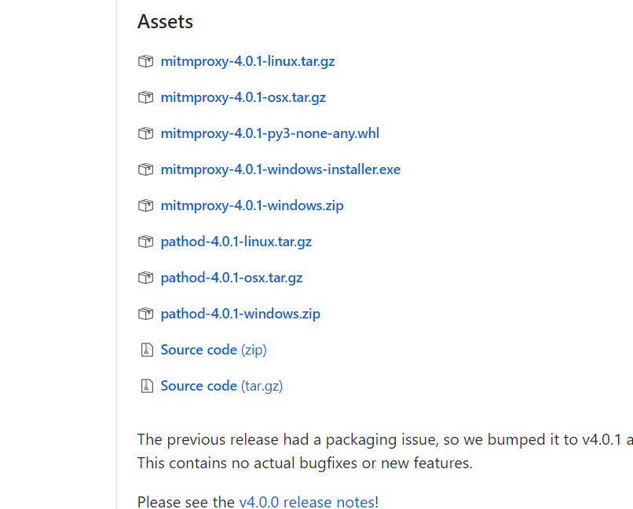
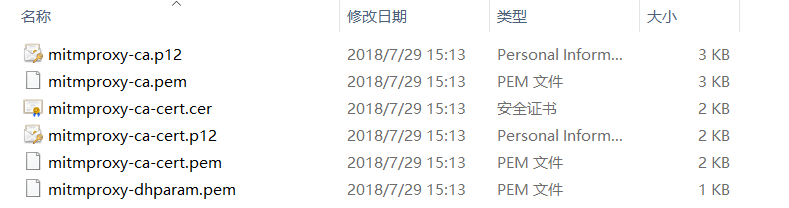

# 1.7.2 mitmproxy的安装

## 1.说明

MitmProxy是一个支持HTTP和HTTPS的抓包程序，类似于Fiddler、Charles功能。

同时MitmProxy还有两个关联组件，一个是MitmDump，是MimtmProxy的命令行接口，另一个是MitmWeb，是一个web程序，可以清楚地观察到MitmProxy捕获的请求

## 2. 相关链接 {#1-相关链接}

* GitHub：[https://github.com/mitmproxy/mitmproxy](https://github.com/mitmproxy/mitmproxy)
* 官方网站：[https://mitmproxy.org](https://mitmproxy.org/)
* PyPi：[https://pypi.python.org/pypi/mitmproxy](https://pypi.python.org/pypi/mitmproxy)
* 官方文档：[http://docs.mitmproxy.org](http://docs.mitmproxy.org/)
* MitmDump脚本：[http://docs.mitmproxy.org/en/stable/scripting/overview.html](http://docs.mitmproxy.org/en/stable/scripting/overview.html)
* 下载地址：[https://github.com/mitmproxy/mitmproxy/releases](https://github.com/mitmproxy/mitmproxy/releases)
* DockerHub：[https://hub.docker.com/r/mitmproxy/mitmproxy](https://hub.docker.com/r/mitmproxy/mitmproxy)

## 3.安装

```text
pip install mitmproxy
```

最简单和通用的安装方式，执行完毕之后即可完成 MitmProxy的安装，另外还安装了MitmDump、MitmWeb 两个组件，如果不想用此种方式安装也可以选择下文列出的专门针对各个平台的安装方式或者 Docker 安装方式。

## 4.windows下的安装

[点击下载](https://github.com/mitmproxy/mitmproxy/releases/)[**mitmproxy-4.0.1-windows-installer.exe**](https://github.com/mitmproxy/mitmproxy/releases/download/v4.0.1/mitmproxy-4.0.1-windows-installer.exe)



## 5. Linux下的安装 {#4-linux下的安装}

[点击下载](https://github.com/mitmproxy/mitmproxy/releases/)[**mitmproxy-4.0.1-linux.tar.gz**](https://github.com/mitmproxy/mitmproxy/releases/download/v4.0.1/mitmproxy-4.0.1-linux.tar.gz)

```text
tar -zxvf mitmproxy-4.0.1-linux.tar.gz
sudo mv mitmproxy mitmdump mitmweb /usr/bin
```

## 6. Mac下的安装 {#5-mac下的安装}

使用 HomeBrew安装 即可，命令如下：

```text
brew install mitmproxy
```

执行命令后即可完成 MitmProxy 的安装。

## 7. Docker安装 {#6-docker安装}

MitmProxy 也支持 Docker，其 Docker Hub 的地址为[https://hub.docker.com/r/mitmproxy/mitmproxy/](https://hub.docker.com/r/mitmproxy/mitmproxy/)

Docker 下 MitmProxy 的安装命令为：

```text
docker run --rm -it -p 8080:8080 mitmproxy/mitmproxy mitmdump
```

这样就在 8080 端口上启动了 MitmProxy 和 MitmDump。

如果想要获取 CA 证书，可以选择挂载磁盘选项，命令如下：

```text
docker run --rm -it -v ~/.mitmproxy:/home/mitmproxy/.mitmproxy -p 8080:8080 mitmproxy/mitmproxy mitmdump
```

这样可以在 ~/.mitmproxy 目录找到 CA 证书。

另外还可以在 8081 端口上启动 MitmWeb，命令如下：

```text
docker run --rm -it -p 8080:8080 -p 127.0.0.1:8081:8081 mitmproxy/mitmproxy mitmweb
```

## 8. 证书配置 {#7-证书配置}

对于 MitmProxy 来说，如果想要截获 HTTPS 请求，我们就需要设置证书，MitmProxy 在安装后会提供一套 CA 证书，只要客户端信任了 MitmProxy 提供的证书，我们就可以通过 MitmProxy 获取 HTTPS 请求的具体内容，否则 MitmProxy 是无法解析 HTTPS 请求的。

首先运行一下命令产生 CA 证书，启动 MitmDump 即可：

```text
mitmdump
```

这样即可启动 MitmDump，接下来我们就可以在用户目录下的 .mitmproxy 目录里面找到 CA 证书，如图 1-61 所示：



图 1-61 证书文件

证书一共五个，下面是对这五个证书的说明：

| 名称 | 描述 |
| :--- | :--- |
| mitmproxy-ca.pem | PEM 格式的证书私钥 |
| mitmproxy-ca-cert.pem | PEM 格式证书，适用于大多数非 Windows 平台 |
| mitmproxy-ca-cert.p12 | PKCS12 格式的证书，适用于 Windows 平台 |
| mitmproxy-ca-cert.cer | 与 mitmproxy-ca-cert.pem 相同，只是改变了后缀，适用于部分 Android 平台 |
| mitmproxy-dhparam.pem | PEM 格式的秘钥文件，用于增强 SSL 安全性 |

下面我们介绍一下 Windows、Mac、iOS、Android 平台下的证书配置过程。

### Windows {#windows}

双击 mitmproxy-ca.p12，就会出现导入证书的引导页，如图 1-62 所示。


图 1-62 证书导入向导

直接点击下一步即可，接下来会出现密码设置提示，如图 1-63 所示：


图 1-63 密码设置提示

不需要设置密码，直接点击下一步即可。

接下来需要选择证书的存储区域，如图 1-64 所示：


图 1-64 选择证书存储区域

点击第二个选项“将所有证书放入下列存储”，然后点击浏览，再选择证书存储位置为“受信任的根证书颁发机构”，确定，点击下一步。

最后如果有安全警告均点击“是”即可，如图 1-65 所示：


图 1-65 安装警告

这样就配置完成 Windows 下信任 CA 证书了。

### Mac {#mac}

Mac 下双击 mitmproxy-ca-cert.pem 即可弹出钥匙串管理页面，然后找到 mitmproxy 证书，点击打开其设置选项，选择始终信任即可，如图 1-66 所示：


图 1-66 证书配置

这样就配置完成 Mac 下信任 CA 证书了。

### iOS {#ios}

将 mitmproxy-ca-cert.pem 文件发送到 iPhone 上，推荐使用邮件的方式发送，iPhone 上可以直接点击附件并识别安装，如图 1-67 所示：


图 1-67 证书安装页面

点击之后会跳到安装描述文件的页面，点击右上角的安装按钮即可安装，此处会有警告提示，如图 1-68 所示：


图 1-68 安装警告页面

继续点击右上角的安装即可，安装成功之后会有已安装的提示，如图 1-69 所示：


如果你的 iOS 版本是 10.3 以下的话，此处信任 CA 证书的流程就已经完成了。

如果你的 iOS 版本是 10.3 及以上，还需要在设置-&gt;通用-&gt;关于本机-&gt;证书信任设置将证书添加完全信任，如图 1-70 所示：


图 1-70 证书信任设置

在这里将 MitmProxy 的完全信任开关打开即可。

这样 iOS 上配置信任 CA 证书的流程就结束了。

### Android {#android}

Android 手机同样需要将证书 mitmproxy-ca-cert.pem 文件发送到手机上，例如直接拷贝文件。

接下来点击证书便会出现一个提示窗口，如图 1-71 所示：


图 1-71 证书安装页面

这时输入证书的名称，然后点击确定即可完成安装。

