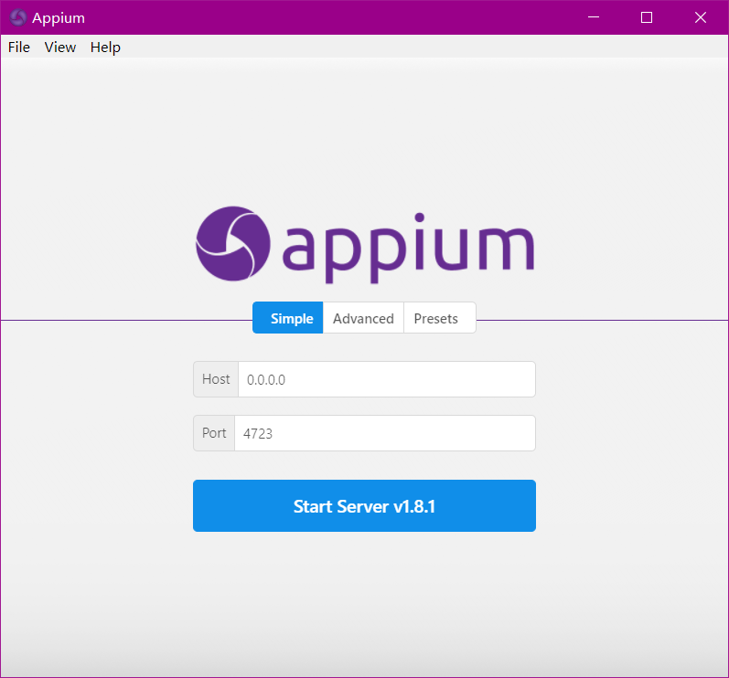

# 1.7.3 Appium的安装

## 1.说明

Appium是移动端的自动化测试工具，可以利用它驱动Android等设备完成自动化测试，比如模拟点击、滑动、输入等操作

## 2. 相关链接 {#1-相关链接}

* GitHub：[https://github.com/appium/appium](https://github.com/appium/appium)
* 官方网站：[http://appium.io](http://appium.io/)
* 官方文档：[http://appium.io/introduction.html](http://appium.io/introduction.html)
* 下载链接：[https://github.com/appium/appium-desktop/releases](https://github.com/appium/appium-desktop/releases)
* Python Client：[https://github.com/appium/python-client](https://github.com/appium/python-client)

## 3. 安装Appium {#2-安装appium}

首先我们需要安装 Appium，Appium 负责驱动移动端来完成一系列操作，对 iOS 设备来说，它使用苹果的 UIAutomation 来实现驱动，对于 Android 来说，它使用 UiAutomator 和 Selendroid 来实现驱动。

同时 Appium 也相当于一个服务器，可以向 Appium 发送一些操作指令，Appium 就会根据不同的指令对移动设备进行驱动，完成不同的动作。

安装 Appium 有两种方式，一种是直接下载安装包 Appium Desktop 来安装，另外一种是通过 Node.js 来安装.

## Appium Desktop

Appium Desktop支持全平台的安装，下载地址:[https://github.com/appium/appium-desktop/releases](https://github.com/appium/appium-desktop/releases)windows平台可以下载exe如[**appium-desktop-web-setup-1.6.2.exe**](https://github.com/appium/appium-desktop/releases/download/v1.6.2/appium-desktop-web-setup-1.6.2.exe),Mac 平台可以下载 dmg 安装包如 [**Appium-1.6.2.dmg**](https://github.com/appium/appium-desktop/releases/download/v1.6.2/Appium-1.6.2.dmg)，Linux 平台可以选择下载源码



## Node.js

安装Node.js

安装方式参见:[http://www.runoob.com/nodejs/nodejs-install-setup.html](http://www.runoob.com/nodejs/nodejs-install-setup.html)

使用npm命令全局安装Appium

```text
npm install -g appium
```

## 4. Android开发环境配置 {#3-android开发环境配置}

如果我们要使用 Android 设备做 App 抓取的话，还需要下载和配置 Android SDK，在这里推荐直接安装 Android Studio，其下载地址为：[https://developer.android.com/studio/index.html?hl=zh-cn](https://developer.android.com/studio/index.html?hl=zh-cn)，下载之后直接安装即可。

当安装完android studio, 第一次启动后，提示出现「Unable to access Android SDK add-on list」。

解决方案：

```text
在 Android Studio 安装目录 E:\Android\Android Studio\bin/idea.properties 文件最后追加一句
disable.android.first.run=true
```

完成之后我们还需要下载 Android SDK，直接打开首选项里面的 Android SDK 设置页面，勾选要安装的 SDK 版本，点击确定即可开始下载和安装勾选的 SDK 版本，如图 1-74 所示：


图 1-74 Android SDK 设置页面

另外还需要配置一下环境变量，添加 ANDROID\_HOME 为 Android SDK 所在路径，然后再添加 SDK 文件夹下的 tools 和 platform-tools 文件夹到 PATH 中。

更详细的配置可以参考 Android Studio 的官方文档：[https://developer.android.com/studio/intro/index.html](https://developer.android.com/studio/intro/index.html)。

## 5. iOS开发环境 {#4-ios开发环境}

首先需要声明的是，Appium 是一个做自动化测试的工具，用它来测试我们自己开发的 App 是完全没问题的，它携带的是开发者证书（Development Certificate）。但如果我们想拿 iOS 设备来做数据爬取的话又是另外一回事了，一般我们做数据爬取都是使用现有的APP，在 iOS 上一般都是通过 App Store 下载的，它携带的是分发证书（Distribution Certificate），而携带这种证书的应用都是禁止被测试的，所以只有获取 ipa 安装包再重新签名之后才可以被 Appium 测试，具体的方法不再展开阐述，如感兴趣可以搜索相关资料。

因此在这里推荐直接使用 Android 来进行测试，如果你可以完成上述操作重签名操作，那么可以参考如下内容配置 iOS 开发环境。

Appium 驱动 iOS 设备必须要在 Mac 下进行，Windows 和 Linux 是平台是无法完成的，下面只介绍一下 Mac 平台的相关配置。

Mac 平台需要的配置如下：

* Mac OS X 10.12 及更高版本
* XCode 8 及更高版本

配置满足要求之后执行如下命令即可配置开发依赖的一些库和工具：

```text
xcode-select --install
```

这样 iOS 部分开发环境就配置完成了，我们就可以用 iOS 模拟器来进行测试和数据抓取了。

如果想要用真机进行测试和数据抓取，还需要额外配置一下其他的环境，可以参考：[https://github.com/appium/appium/blob/master/docs/en/appium-setup/real-devices-ios.md](https://github.com/appium/appium/blob/master/docs/en/appium-setup/real-devices-ios.md)。

