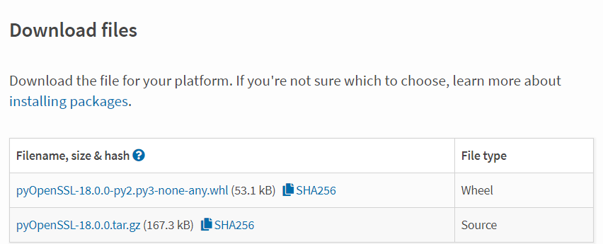
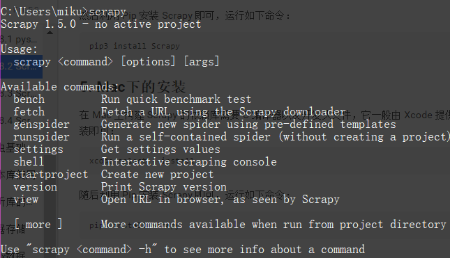

# 1.8.2 Scrapy的安装

## 1. 相关链接 {#1-相关链接}

* 官方网站：[https://scrapy.org](https://scrapy.org/)
* 官方文档：[https://docs.scrapy.org](https://docs.scrapy.org/)
* PyPi：[https://pypi.python.org/pypi/Scrapy](https://pypi.python.org/pypi/Scrapy)
* GitHub：[https://github.com/scrapy/scrapy](https://github.com/scrapy/scrapy)
* 中文文档：[http://scrapy-chs.readthedocs.io](http://scrapy-chs.readthedocs.io/)

## 2. Anaconda安装 {#2-anaconda安装}

如果已经安装好了 Anaconda，那么可以通过 conda 命令安装 Scrapy，安装命令如下：

```text
conda install Scrapy
```

运行之后便可以完成 Scrapy 的安装。

## 3. Windows下的安装 {#3-windows下的安装}

[所有工具可在这里下载](https://pan.baidu.com/s/1ZUb8WhkajsWkUlfDpRiBYg)

### 安装lxml

[lxml安装](../1.3/131-lxmlde-an-zhuang.md)

### 安装pyOpenSSL

wheel文件下载地址:[https://pypi.python.org/pypi/pyOpenSSL\#downloads](https://pypi.python.org/pypi/pyOpenSSL#downloads)下载完成后安装

```text
pip install pyOpenSSL-18.0.0-py2.py3-none-any.whl
```

### 安装Twisted {#安装twisted}

下载 Wheel 文件:[http://www.lfd.uci.edu/~gohlke/pythonlibs/\#twisted](182-scrapyde-an-zhuang.md)

如 Python 3.6 版本，Windows 64 位系统，当前最新版本为 [Twisted‑18.7.0‑cp36‑cp36m‑win\_amd64.whl](javascript:;)

下载完后安装

```text
pip install Twisted‑18.7.0‑cp36‑cp36m‑win_amd64.whl
```

## 安装PyWin32 {#安装pywin32}

从官方网站下载对应版本的安装包即可，链接为：[https://sourceforge.net/projects/pywin32/files/pywin32/Build%20221/](https://sourceforge.net/projects/pywin32/files/pywin32/Build%20221/)

如 Python 3.6 版本可以选择下载 pywin32-221.win-amd64-py3.6.exe，下载完毕之后双击安装即可。

注意这里使用的是 Build 221 版本，随着时间推移，版本肯定会继续更新，最新的版本可以查看：[https://sourceforge.net/projects/pywin32/files/pywin32/](https://sourceforge.net/projects/pywin32/files/pywin32/)，查找最新的版本安装即可。

### 安装Scrapy {#安装scrapy}

```text
pip install scrapy
```

## 4. Linux下的安装 {#4-linux下的安装}

### CentOS、RedHat {#centos、redhat}

首先确保一些依赖库已经安装，运行如下命令：

```text
sudo yum groupinstall -y development tools
sudo yum install -y epel-release libxslt-devel libxml2-devel openssl-devel
```

最后利用 Pip 安装 Scrapy 即可，运行如下命令：

```text
pip3 install Scrapy
```

### Ubuntu、Debian、Deepin {#ubuntu、debian、deepin}

首先确保一些依赖库已经安装，运行如下命令：

```text
sudo apt-get install build-essential python3-dev libssl-dev libffi-dev libxml2 libxml2-dev libxslt1-dev zlib1g-dev
```

然后利用 Pip 安装 Scrapy 即可，运行如下命令：

```text
pip3 install Scrapy
```

## 5. Mac下的安装 {#5-mac下的安装}

在 Mac 上构建 Scrapy 的依赖库需要 C 编译器以及开发头文件，它一般由 Xcode 提供，运行如下命令安装即可：

```text
xcode-select --install
```

随后利用 Pip 安装 Scrapy 即可，运行如下命令：

```text
pip3 install Scrapy
```

## 6. 验证安装 {#6-验证安装}

安装之后，在命令行下输入 scrapy

```text
scrapy
```



出现如上结果，就代表scrapy安装成功了。

## 7. 常见错误 {#7-常见错误}

### pkg\_resources.VersionConflict: \(six 1.5.2 \(/usr/lib/python3/dist-packages\), Requirement.parse\('six&gt;=1.6.0'\)\) {#pkgresourcesversionconflict-six-152-usrlibpython3dist-packages-requirementparsesix160}

six 包版本过低，six包是一个提供兼容 Python2 和 Python3 的库，升级 six 包即可：

```text
sudo pip3 install -U six
```

### c/\_cffi\_backend.c:15:17: fatal error: ffi.h: No such file or directory {#ccffibackendc1517-fatal-error-ffih-no-such-file-or-directory}

这是在 Linux 下常出现的错误，缺少 Libffi 这个库。什么是 libffi？“FFI” 的全名是 Foreign Function Interface，通常指的是允许以一种语言编写的代码调用另一种语言的代码。而 Libffi 库只提供了最底层的、与架构相关的、完整的”FFI”。

安装相应的库即可。

Ubuntu、Debian：

```text
sudo apt-get install build-essential libssl-dev libffi-dev python3-dev
```

CentOS、RedHat:

```text
sudo yum install gcc libffi-devel python-devel openssl-devel
```

### Command "python setup.py egg\_info" failed with error code 1 in /tmp/pip-build/cryptography/ {#command-python-setuppy-egginfo-failed-with-error-code-1-in-tmppip-buildcryptography}

这是缺少加密的相关组件，利用Pip 安装即可。

```text
pip3 install cryptography
```

### ImportError: No module named 'packaging' {#importerror-no-module-named-packaging}

缺少 packaging 这个包，它提供了 Python 包的核心功能，利用 Pip 安装即可。

### ImportError: No module named '\_cffi\_backend' {#importerror-no-module-named-cffibackend}

缺少 cffi 包，使用 Pip 安装即可：

```text
pip3 install cffi
```

### ImportError: No module named 'pyparsing' {#importerror-no-module-named-pyparsing}

缺少 pyparsing 包，使用 Pip 安装即可：

```text
pip3 install pyparsing appdirs
```

