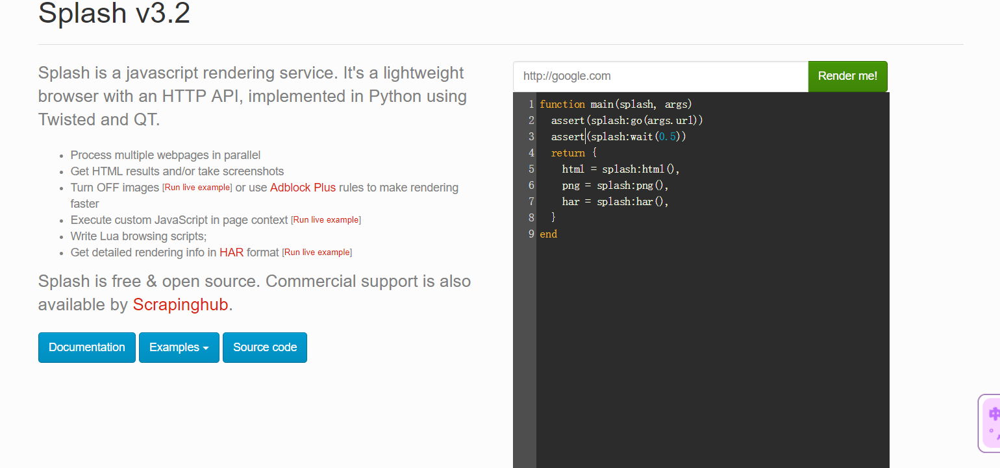

# 1.8.3 Scrapy-Splash的安装

ScrapySplash 是一个 Scrapy 中支持 JavaScript 渲染的工。

## 1. 相关链接 {#1-相关链接}

* GitHub：[https://github.com/scrapy-plugins/scrapy-splash](https://github.com/scrapy-plugins/scrapy-splash)
* PyPi：[https://pypi.python.org/pypi/scrapy-splash](https://pypi.python.org/pypi/scrapy-splash)
* 使用说明：[https://github.com/scrapy-plugins/scrapy-splash\#configuration](https://github.com/scrapy-plugins/scrapy-splash#configuration)
* Splash 官方文档：[http://splash.readthedocs.io](http://splash.readthedocs.io/)

## 2. 安装Splash {#2-安装splash}

拉取镜像

```
docker pull scrapinghub/splash
```

ScrapySplash 会使用 Splash 的 HTTP API 进行页面渲染，所以我们需要安装 Splash 来提供渲染服务，安装是通过[ Docker 安装](../19-bu-shu-xiang-guan-ku-de-an-zhuang/191-dockerde-an-zhuang.md)，在这之前请确保已经正确安装好了 Docker。

安装命令如下：

```text
docker run -p 8050:8050 scrapinghub/splash
```

安装完成之后会有类似的输出结果：

```text
2017-07-03 08:53:28+0000 [-] Log opened.
2017-07-03 08:53:28.447291 [-] Splash version: 3.0
2017-07-03 08:53:28.452698 [-] Qt 5.9.1, PyQt 5.9, WebKit 602.1, sip 4.19.3, Twisted 16.1.1, Lua 5.2
2017-07-03 08:53:28.453120 [-] Python 3.5.2 (default, Nov 17 2016, 17:05:23) [GCC 5.4.0 20160609]
2017-07-03 08:53:28.453676 [-] Open files limit: 1048576
2017-07-03 08:53:28.454258 [-] Can't bump open files limit
2017-07-03 08:53:28.571306 [-] Xvfb is started: ['Xvfb', ':1599197258', '-screen', '0', '1024x768x24', '-nolisten', 'tcp']
QStandardPaths: XDG_RUNTIME_DIR not set, defaulting to '/tmp/runtime-root'
2017-07-03 08:53:29.041973 [-] proxy profiles support is enabled, proxy profiles path: /etc/splash/proxy-profiles
2017-07-03 08:53:29.315445 [-] verbosity=1
2017-07-03 08:53:29.315629 [-] slots=50
2017-07-03 08:53:29.315712 [-] argument_cache_max_entries=500
2017-07-03 08:53:29.316564 [-] Web UI: enabled, Lua: enabled (sandbox: enabled)
2017-07-03 08:53:29.317614 [-] Site starting on 8050
2017-07-03 08:53:29.317801 [-] Starting factory 
<twisted.web.server.Site object at 0x7ffaa4a98cf8>
```

这样就证明 Splash 已经在 8050 端口上运行了。

这时我们打开：[http://localhost:8050](http://localhost:8050/)即可看到 Splash 的主页

当然 Splash 也可以直接安装在远程服务器上，我们在服务器上运行以守护态运行 Splash 即可，命令如下：

```text
docker run -d -p 8050:8050 scrapinghub/splash
```

在这里多了一个 -d 参数，它代表将 Docker 容器以守护态运行，这样在中断远程服务器连接后不会终止 Splash 服务的运行。

## 3. ScrapySplash的安装 {#3-scrapysplash的安装}

成功安装了 Splash 之后，我们接下来再来安装一下其 Python 库，安装命令如下：

```text
pip3 install scrapy-splash
```


