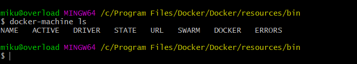

# 1.9.1 Docker的安装

## Docker 是什么 {#Docker入门-Docker是什么}

Docker 是一种容器技术，它可以将应用和环境等进行打包，形成一个独立的，类似于 iOS 的 APP 形式的「应用」，这个应用可以直接被分发到任意一个支持 Docker 的环境中，通过简单的命令即可启动运行。Docker 是一种最流行的容器化实现方案。和虚拟化技术类似，它极大的方便了应用服务的部署；又与虚拟化技术不同，它以一种更轻量的方式实现了应用服务的打包。使用 Docker 可以让每个应用彼此相互隔离，在同一台机器上同时运行多个应用，不过他们彼此之间共享同一个操作系统。Docker 的优势在于，它可以在更细的粒度上进行资源的管理，也比虚拟化技术更加节约资源。

[官方文档](http://guide.daocloud.io/dcs/docker-9152673.html)

### 1. 相关链接 {#1-相关链接}

* 官方网站：[https://www.docker.com](https://www.docker.com/)
* GitHub：[https://github.com/docker](https://github.com/docker)
* Docker Hub：[https://hub.docker.com](https://hub.docker.com/)
* 官方文档：[https://docs.docker.com](https://docs.docker.com/)
* DaoCloud：[http://www.daocloud.io](http://www.daocloud.io/)
* 中文社区：[http://www.docker.org.cn](http://www.docker.org.cn/)
* 中文教程：[http://www.runoob.com/docker/docker-tutorial.html](http://www.runoob.com/docker/docker-tutorial.html)
* 推荐书籍：[https://yeasy.gitbooks.io/docker\_practice](https://yeasy.gitbooks.io/docker_practice)

### 2.在windows下安装

Windows10 64位安装:推荐使用 [Docker for Windows](https://docs.docker.com/docker-for-windows/install/)

非Windows10 64位系统安装:[https://docs.docker.com/toolbox/toolbox\_install\_windows/](https://docs.docker.com/toolbox/toolbox_install_windows/)

这里以VMware Workstation为例:

#### 环境:

* Hyper-V：已卸载
* VMware：已安装
* Virtual Box：无安装

#### 驱动

下载地址:[https://github.com/pecigonzalo/docker-machine-vmwareworkstation/releases/latest](https://github.com/pecigonzalo/docker-machine-vmwareworkstation/releases/latest)

#### 复制

* 通过InstallDocker.msi安装的，复制到C:\Program Files\Docker\Docker\resources\bin下
* 通过DockerToolbox.exe安装的，复制到C:\Program Files\Docker Toolbox下

#### 打开**git-bash**，输入以下命令：

`docker-machine ls`



检查是否有machine实例，如果有，请考虑是否卸载它

```text
docker-machine stop dev && docker-machine rm dev
```

停止NAME为default的machine实例

```text
docker-machine stop default
```

删除NAME为default的machine实例

```text
docker-machine rm default
```

创建一个名称为default的machine实例

```text
docker-machine create --driver=vmwareworkstation default
```

启用

```text
docker-machine active default
```

## 使用[Docker Toolbox](https://docs.docker.com/toolbox/toolbox_install_windows/)进行安装

1. 不使用VirtualBox安装Docker Toolbox

   `DockerToolbox-.exe /COMPONENTS="Docker,DockerMachine"`

2. `C:\Program Files\Docker Toolbox\start.sh`用此脚本替换内容。

```text
!/bin/bash
export PATH="$PATH:/mnt/c/Program Files (x86)/VMware/VMware Workstation"
trap '[ "$?" -eq 0 ] || read -p "Looks like something went wrong in step ´$STEP´... Press any key to continue..."' EXIT
VM=${DOCKER_MACHINE_NAME-default}
DOCKER_MACHINE=./docker-machine.exe
BLUE='\033[1;34m'
GREEN='\033[0;32m'
NC='\033[0m'
if [ ! -f "${DOCKER_MACHINE}" ]; then
     echo "Docker Machine is not installed. Please re-run the Toolbox Installer and try again."
     exit 1
   fi
vmrun.exe list | grep \""${VM}"\" &> /dev/null
   VM_EXISTS_CODE=$?
set -e
STEP="Checking if machine $VM exists"
   if [ $VM_EXISTS_CODE -eq 1 ]; then
     "${DOCKER_MACHINE}" rm -f "${VM}" &> /dev/null || :
     rm -rf ~/.docker/machine/machines/"${VM}"
 #set proxy variables if they exists
 if [ -n ${HTTP_PROXY+x} ]; then
   PROXY_ENV="$PROXY_ENV --engine-env HTTP_PROXY=$HTTP_PROXY"
 fi
 if [ -n ${HTTPS_PROXY+x} ]; then
   PROXY_ENV="$PROXY_ENV --engine-env HTTPS_PROXY=$HTTPS_PROXY"
 fi
 if [ -n ${NO_PROXY+x} ]; then
   PROXY_ENV="$PROXY_ENV --engine-env NO_PROXY=$NO_PROXY"
 fi  
 "${DOCKER_MACHINE}" create -d vmwareworkstation $PROXY_ENV "${VM}"
fi
STEP="Checking status on $VM"
   VM_STATUS="$(${DOCKER_MACHINE} status ${VM} 2>&1)"
   if [ "${VM_STATUS}" != "Running" ]; then
     "${DOCKER_MACHINE}" start "${VM}"
     yes | "${DOCKER_MACHINE}" regenerate-certs "${VM}"
   fi
STEP="Setting env"
   eval "$(${DOCKER_MACHINE} env --shell=bash ${VM})"
STEP="Finalize"
   clear
   cat << EOF
                       ##         .
                 ## ## ##        ==
              ## ## ## ## ##    ===
          /"""""""""""""""""\___/ ===
     ~~~ {~~ ~~~~ ~~~ ~~~~ ~~~ ~ /  ===- ~~~
          \______ o           __/
            \    \         __/
             \____\_______/
EOF
   echo -e "${BLUE}docker${NC} is configured to use the ${GREEN}${VM}${NC} machine with IP ${GREEN}$(${DOCKER_MACHINE} ip ${VM})${NC}"
   echo "For help getting started, check out the docs at 
https://docs.docker.com
"
   echo
   cd
docker () {
     MSYS_NO_PATHCONV=1 docker.exe "$@"
   }
   export -f docker
if [ $# -eq 0 ]; then
     echo "Start interactive shell"
     exec "$BASH" --login -i
   else
     echo "Start shell with command"
     exec "$BASH" -c "$*"
   fi
```

然后与上面同样的操作

### Linux下的安装 {#3-linux下的安装}

### 卸载旧版本 {#uninstall-old-versions}

```text
$sudoapt-get remove docker docker-engine docker.io
```

### 使用 APT 安装 {#使用-apt-安装}

由于`apt`源使用 HTTPS 以确保软件下载过程中不被篡改。因此，我们首先需要添加使用 HTTPS 传输的软件包以及 CA 证书。

```text
$ sudo apt-get update

$ sudo apt-get install \
    apt-transport-https \
    ca-certificates \
    curl \
    software-properties-common
```

鉴于国内网络问题，强烈建议使用国内源，官方源请在注释中查看。

为了确认所下载软件包的合法性，需要添加软件源的`GPG`密钥。

```text
$ curl -fsSL https://mirrors.ustc.edu.cn/docker-ce/linux/ubuntu/gpg | sudo apt-key add -


# 官方源
# $ curl -fsSL https://download.docker.com/linux/ubuntu/gpg | sudo apt-key add -
```

然后，我们需要向`source.list`中添加 Docker 软件源

```text
$ sudo add-apt-repository \
    "deb [arch=amd64] https://mirrors.ustc.edu.cn/docker-ce/linux/ubuntu \
    $(lsb_release -cs) \
    stable"


# 官方源
# $ sudo add-apt-repository \
#    "deb [arch=amd64] https://download.docker.com/linux/ubuntu \
#    $(lsb_release -cs) \
#    stable"
```

> 以上命令会添加稳定版本的 Docker CE APT 镜像源，如果需要测试或每日构建版本的 Docker CE 请将 stable 改为 test 或者 nightly。

#### 安装 Docker CE {#安装-docker-ce}

更新 apt 软件包缓存，并安装`docker-ce`：

```text
$ sudo apt-get update

$ sudo apt-get install docker-ce
```

### 使用脚本自动安装 {#使用脚本自动安装}

在测试或开发环境中 Docker 官方为了简化安装流程，提供了一套便捷的安装脚本，Ubuntu 系统上可以使用这套脚本安装：

```text
$ curl -fsSL get.docker.com -o get-docker.sh
$ sudo sh get-docker.sh --mirror Aliyun
```

执行这个命令后，脚本就会自动的将一切准备工作做好，并且把 Docker CE 的 Edge 版本安装在系统中。

### 启动 Docker CE {#启动-docker-ce}

```text
$ sudo systemctl 
enable
 docker
$ sudo systemctl start docker
```

Ubuntu 14.04 请使用以下命令启动：

```text
$ sudo service docker start
```

### 验证安装

```text
docker run hello-world
```

### 修改 Docker 源为国内源

执行`docker-machine.exe ssh default`

接下来修改配置文件`sudo vi /var/lib/boot2docker/profile`

在`--label provider=vmwareworkstation`的下一行添加`--registry-mirror https://registry.docker-cn.com`

保存后运行退出 ssh

运行`docker-machine restart`

