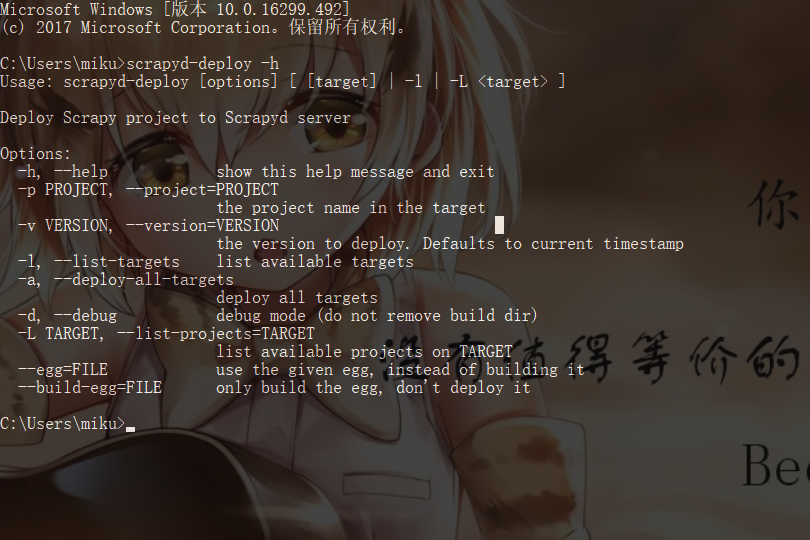

# 1.9.3 ScrapydClient的安装

## 1.说明

ScrapydClient具有能够将Scrapy代码布署到远程Scrapyd的功能，减少了手动将代码打包成egg文件，并将egg文件上传到远程主机的过程。

## 2.相关链接 {#1-相关链接}

* GitHub：[https://github.com/scrapy/scrapyd-client](https://github.com/scrapy/scrapyd-client)
* PyPi：[https://pypi.python.org/pypi/scrapyd-client](https://pypi.python.org/pypi/scrapyd-client)
* 使用说明：[https://github.com/scrapy/scrapyd-client\#scrapyd-deploy](https://github.com/scrapy/scrapyd-client#scrapyd-deploy)

## 3.安装

```text
pip install scrapyd-client
```

## 4.验证安装

```text
scrapyd-deploy -h
```

在windows下会报错，报找不到变量的错误

还需要进行如下配置

首先在E:\Python36\Scripts目录下创建scrapy.bat和scrapyd-deploy.bat两个文件，然后分别向两个文件写入内容:

scrapy.bat

```text
@echo off
E:\Python36\python E:\Python36\Scripts\scrapy %*
```

scrapyd-deploy.bat

```text
@echo off
E:\Python36\python E:\Python36\Scripts\scrapyd-deploy %*
```

这样就能成功运行了



