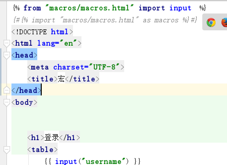

# 26 宏的导入和注意事项

和python一样，import

\#\#\# 导入宏

1. import "路径" as 别名
2. from "路径" import 宏的名字 \[as 别名\]

3.宏文件路劲，不要以相对路劲去寻找,都要以'templates'作为绝对路劲去寻找

如果想要在导入宏的时候，就把当前模板的一些参数传给宏所在的模板，那么就应该在导入的时候使用"with context"

实例:from xxx import xx with context

```text

```




