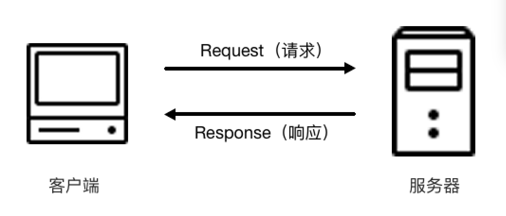
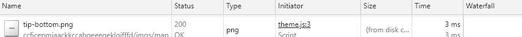
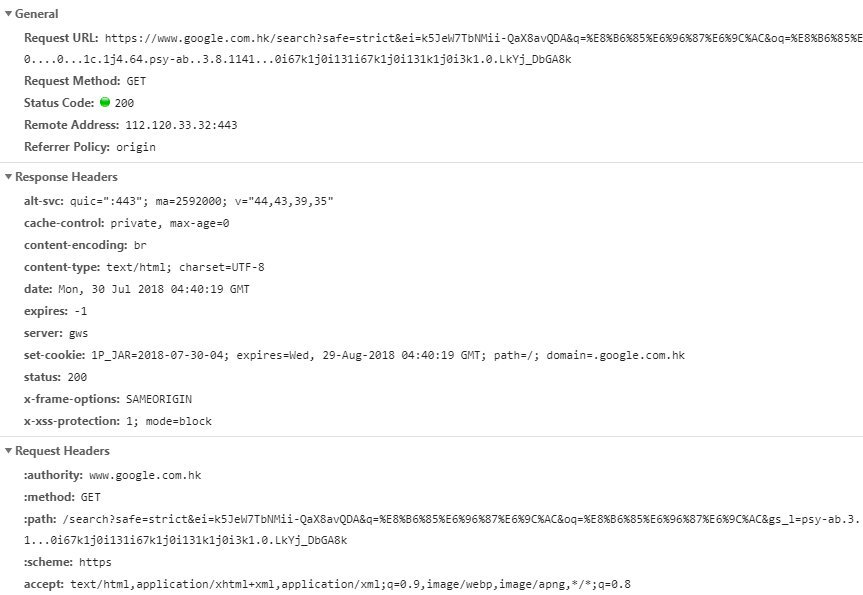

# 2.1.4 HTTP请求过程

当在浏览器输入一个url，回车后，便可看到该网页的内容，实际上过程是浏览器向该网站的服务器发送一个Request\(请求\)，网站的服务器接收之后，然后返回与之对应的一个Response\(响应\)，然后返回给浏览器，response响应中包含了页面的源代码等内容，浏览器解析会后便将网页给呈现出来

按下F12，然后点击network面板，便可看到一次发送请求和接收响应之间的过程

一个条目的名称及含义：

* Name，即 Request 的名称。
* Status，即 Response 的状态码。通过状态码我们可以判断发送了 Request 之后是否得到了正常的 Response。
* Type，即 Request 请求的文档类型。
* Initiator，即请求源。
* Size，即从服务器下载的文件和请求的资源大小。
* Time，即发起 Request 到获取到 Response 所用的总时间。
* Timeline，即网络请求的可视化瀑布流。

点击某条目可以看到更详细的信息

General部分中属性的含义:

* Request URL 为 Request 的 URL
* Request Method 为请求的方法
* Status Code 为响应状态码
* Remote Address 为远程服务器的地址和端口
* Referrer Policy 为 Referrer 判别策略

Response Headers 和一个 Request Headers，这分别代表响应头和请求头，请求头里面带有许多请求信息，例如浏览器标识、Cookies、Host 等信息，这是 Request 的一部分，服务器会根据请求头内的信息判断请求是否合法，进而作出对应的响应，返回 Response，那么在图中看到的 Response Headers 就是 Response 的一部分，例如其中包含了服务器的类型、文档类型、日期等信息，浏览器接受到 Response 后，会解析响应内容，进而呈现网页内容

