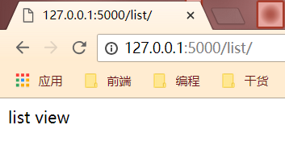

# 38 标准类视图及其使用场景

## 类视图

之前的视图都是函数，所以一般简称为视图函数。其实视图也可以基于类来实现，类视图的好处是支持继承，但是类视图不能跟函数视图一样，写完类视图好需要通过 app.add\_urlrule\(urlrule,view\_func\)。以下将对两种类视图进行讲解:

## 标准视图:

标准视图继承自flask.views.View,并且在子类中必须实现 dispatch\_request方法，这个方法类似于视图函数，也要返回一个基于Response或者子类的对象，以下将用一个例子进行讲解:

```text
class BaseView(views.View):
    # 自定义方法，用来获取模板路径
    def get_template_name(self):
        raise NotImplementedError()

    # 必须实现的方法，用来处理请求的
    def dispatch_request(self):
        if request.method != 'GET':
            return 'method error'

        # 这想从self.get_data()中获取函数，子类应该实现这个方法
        context = {'data':self.get_data()}
        return render_template(self.get_template_name(),**context)

class UserView(BaseView):
    # 实现从父类继承的获取模板路径的方法
    def get_template_name(self):
        return 'user.html'

    # 重写获取函数的方法
    def get_data(self):
        return [{
            'username':'false',
            'avatar':'http://www.baidu.com',
        }]

# 类视图通过add_url_rule方法和url做映射
app.add_url_rule('/users/',view_func=UserView.as_view('userview'))
```

## 基于调度方法的视图:

Flask提供了另外一种类视图flask.views.MethodView，对每个HTTP方法执行不同的函数\(映射到对应的方法的小写的同名方法上\)，还对 RESTful API尤其有用，例子:

```text
class UserAPI(views.MethodView):
    #客户端通过get方法进行访问的时候执行的函数、
    def get(self):
    return jsonify({
        'username':'angle',
        'avator':'http://www.baidu.com',
    })

    # 当客户端通过post方法进行访问的时候执行的函数
    def post(self):
        return 'UNSUPPORTED'


# 通过add_url_rule添加类视图和url的映射，并且在as_view方法中指定该url的名称，方便url_for函数调用
app.add_url_rule('/myuser/',view_func=UserAPI.as_view('userapiview'))
```

用类视图的一个缺陷就是比较难用装饰器来装饰，比如有时候需要做权限验证的时候，比如:

```text
def user_required(f)
    def decorator(*args,**kwargs):
        if not g.user:
            return 'auth failure'
        return f(*args,**kwargs)
    return decorator
```

如果要在类视图上进行装饰，只能在as\_view函数上进行装饰了，使用方式:

```text
view = user_required(UserAPI.as_view('users'))
app.add_url_rule('/users/',views_func=view)
```

从flask 0.8 开始，还可以通过在类中添加decorators属性来实现对视图的装饰:

```text
class UserAPI(views.MethodView):
    decorator = [user_required]
    ....
```

## 标准类视图

1. 标准类视图，必须继承来自"flask.views.View"
2. 必须实现"dipatch\_request"方法，以后请求过来后，都会执行这个方法，这个方法的返回值就相当于是之前的函数视图一样，也必须返回"Response"或者子类的对象，或者是字符串，或者是元组
3. 必须通过"app.add\_url\_rule\(rule,endpoint,view\_func\)"来做url与视图的映射。'view\_func'这个参数，需要使用类视图下的'as\_view'类方法类转换:ListView.as\_view\('list'\)
4. 如果指定了"endpoint",那么在使用"url\_for"反转的时候就必须使用"endpoint"指定的那个值，如果没有指定"endpoint"，那么就可以使用"as\_view\(视图名字\)"中指定的视图名字作为反转
5. 类视图有以下好处:可以继承，把一些共性的东西抽取出来放到父视图中，子视图直接拿来使用就可以了，但是也不是说所有的视图都要使用类视图，这个要根据情况而定

```text
# 必须继承自views
class ListView(views.View):
    def dispatch_request(self):
        return "list view"

# 类.as_view(name) 返回一个函数,name:视图名
# endpoint没指定，就是用view_func名
app.add_url_rule('/list/',endpoint='list',view_func=ListView.as_view('list'))
```



```text
# 有几个url需要返回json数据，“需要用jsonify”
class JSONView(views.View):
    def get_data(self):
        raise NotImplementedError

    def dispatch_request(self):
        return jsonify(self.get_data())

# #将视图函数中返回的字典，转换成json对象，然后返回
# class JSONResponse(Response):
#
#     @classmethod
#     def force_type(cls, response, environ=None):
#         """
#         这个方法只有视图函数返回非字符，非元组，非Response对象才会调用
#         :param response:
#         :param environ:
#         :return:
#         response，视图函数的返回值
#         """
#         print(response)
#         if isinstance(response,dict):
#         # 转换
#             response = jsonify(response)
#         return super(JSONResponse,cls).force_type(response,environ)

# 添加response类，一定要添加
# app.response_class = JSONResponse

# 必须继承自views
class ListView(JSONView):
    def get_data(self):
        return {"username":"angle"}
```


```text
class ADSView(views.View):
    def __init__(self):
        super(ADSView,self).__init__()
        self.context = {
            'ads':"广告"
        }

# 提取共同变量
class LoginView(ADSView):
    def dispatch_request(self):
        self.context.update({
            'username':'login',
        })
        return render_template('login.html',**self.context)

class RegistView(ADSView):
    def dispatch_request(self):
        return render_template('regist.html',**self.context)
```


