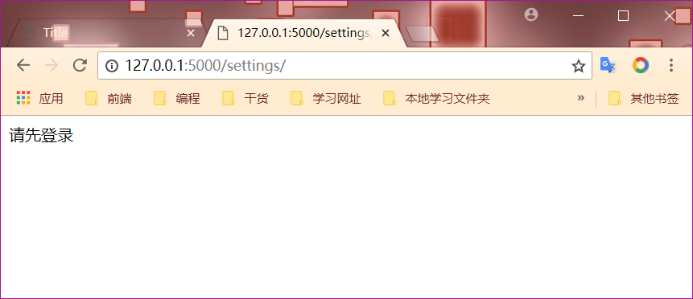
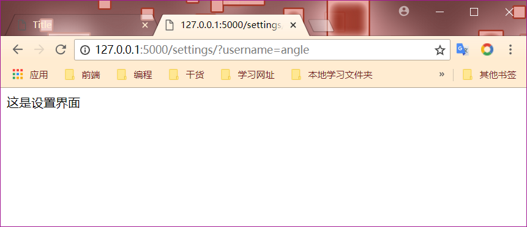

# 40 类视图中使用装饰器

1. 如果使用的是函数视图，那么自己定义的装饰器必须放在"app.route"下面，否者装饰器失效
2. 类视图的装饰器，需要重写类视图的一个类属性"decorators"，这个类属性是一个列表或者元组都可以，里面装的是装饰器

```text
from flask import Flask,request
from functools import wraps

app = Flask(__name__)

def login_required(func):
    @wraps(func)
    def wrapper(*args,**kwargs):
        # 获取参数
        # login?username=xxx
        username  = request.args.get("username")
        if username and username == "angle":
            return func(*args,**kwargs)
        else:
            return "请先登录"
    return wrapper


@app.route('/')
def hello_world():
    return 'Hello World!'

@app.route('/settings/')
@login_required
def settings():
    return "这是设置界面"

if __name__ == '__main__':
    app.run(debug=True)
```



```text
class ProfileView(views.View):

    # 装饰器
    decorators = [login_required]

    def dispatch_request(self):
        return "个人中心界面"

app.add_url_rule(rule='/profile/',view_func=ProfileView.as_view('profile'))
```

