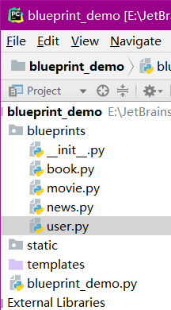

# 41 蓝图的基本使用



```text
blueprint_demo.py

from flask import Flask,Blueprint

from blueprints.news import news_bp
from blueprints.user import user_bp

# Blueprint蓝图:将大型flask项目模块化

app = Flask(__name__)
# 注册一个蓝图
app.register_blueprint(user_bp)
app.register_blueprint(news_bp)
# 用户模块
# 新闻模块
# 电影模块
# 读书模块

@app.route('/')
def hello_world():
    return 'Hello World!'


if __name__ == '__main__':
    app.run(debug=True)
```

```text
user.py

from flask import Blueprint

user_bp = Blueprint('user',__name__)

# 个人中心的url与视图函数
@user_bp.route('/profile/')
def profile():
    return '个人中心页面'

@user_bp.route('/settings/')
def settings():
    return "个人中心页面"
```

```text
news.py

from flask import Blueprint

news_bp = Blueprint('news',__name__)

@news_bp.route('/list/')
def news_list():
    return '新闻列表'

@news_bp.route('/detail/')
def detail():
    return '新闻详情页面'
```

## 蓝图

* 蓝图的作用就是让flask项目更加模块化，结构更加清晰，可以将相同模块的视图函数放在同一个蓝图下，同一个文件中，方便管理
* 基本语法:
* 在蓝图文件中导入Blueprint：

```text
'from flask import Blueprint'
# 注意url_prefix参数的斜杠
user_bp = Blueprint('user',__name__,url_prefix='/user')
# http://127.0.0.1:5000/user/profile/
```

* 在主app文件中注册蓝图:

```text
from blueprints.user import user_bp

app.regist_blueprint(user_bp)
```

* 如果想要某个蓝图下的所有url都有一个url前缀，那么可以定义蓝图的时候，指定url\_prefix参数:

```text
user_bp = Blueprint('user',__name__,url_prefix='/user/')
```

