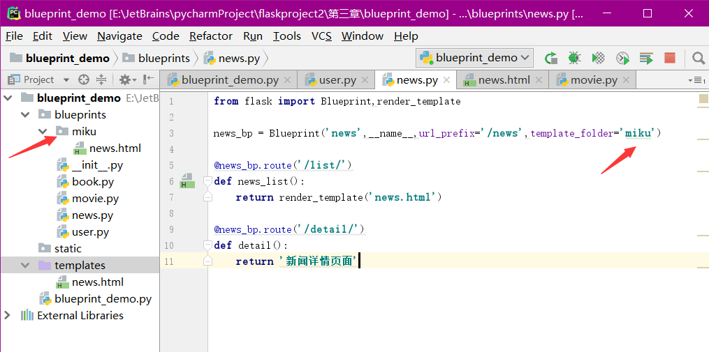

# 42 蓝图中模版文件寻找规则

## 指定模板文件

```text
from flask import Blueprint,render_template

news_bp = Blueprint('news',__name__,url_prefix='/news',template_folder='miku')

@news_bp.route('/list/')
def news_list():
    return render_template('news.html')

@news_bp.route('/detail/')
def detail():
    return '新闻详情页面'
```

## 

## 蓝图模板文件查找

* 如果项目中的templates文件夹中有相应的模板文件，就直接使用了
* 如果项目中的templates文件夹中没有相应的模板文件，那么就到在定义蓝图的时候指定的路径中寻找，并且蓝图中的指定可以为相对路径，相对的是当前这个蓝图的文件所在的目录

```text
news_bp = Blueprint('news',__name__,url_prefix='/news',template_folder='miku')
```

因为这个蓝图文件是在blueprints/news.py，那么就会到blueprints文件夹下的miku文件夹中寻找模板文件

