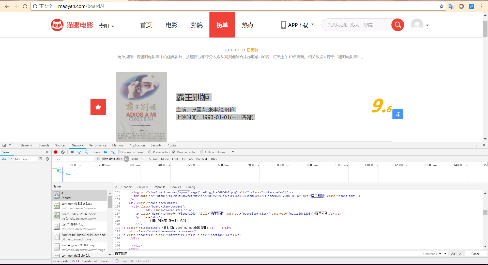

# 3.4 抓取猫眼电影排行

## 实战演练

利用 Requests 和正则表达式来抓取猫眼电影 TOP100 的相关内容

## 1.目标

猫眼电影地址:[http://maoyan.com/board/4](http://maoyan.com/board/4)

需要:要提取出猫眼电影 TOP100 榜的电影名称、时间、评分、图片等信息,提取的结果我们以文件形式保存下来

## 2.准备

确保[安装requests库](../../1kai-fa-huan-jing-pei-zhi/12-qing-qiu-ku-de-an-zhuang/121-requestsde-an-zhuang.md)

## 3.抓取分析

打开[http://maoyan.com/board/4可以查看榜单信息](http://maoyan.com/board/4可以查看榜单信息)


在图中可以清楚地看到影片的信息，页面中显示的信息有影片名称、主演、上映时间、上映地区、评分、图片等

之后点击下一页

可以发现[http://maoyan.com/board/4?offset=10比之前的url多了一个参数offset，参数值为10，目前显示的排行数据11~20，可以判断offset是一个偏移量的参数再点击下一页，发现页面的](http://maoyan.com/board/4?offset=10比之前的url多了一个参数offset，参数值为10，目前显示的排行数据11~20，可以判断offset是一个偏移量的参数再点击下一页，发现页面的) URL 变成了：[http://maoyan.com/board/4?offset=20](http://maoyan.com/board/4?offset=20)，参数 offset 变成了 20，而显示的结果是排行 21-30 的电影

可以判断offset是一个偏移量，如果偏移值为n，则当前页面的序号为n+1到n+10，这样就可以更根据offset获取top100的所有电影信息了

## 4.抓取首页

定义一个get\_first\_page\(\)函数方法，实现抓取首页，代码实现

```text
import requests
import time

headers = {
'Cookie': 'uuid_n_v=v1; uuid=AF3D1220948011E8B2AA9FA8B2681702285785F0A8C6440893B814F988D9E847; _csrf=7e74e8ba9e19ad80506d12f9c59ca4d0663c09568af4bd8ab119e7fa42cf0406; _lxsdk_cuid=164eec2d003c8-08f976660a5271-2711f38-144000-164eec2d003c8; _lxsdk=AF3D1220948011E8B2AA9FA8B2681702285785F0A8C6440893B814F988D9E847; __mta=210171562.1533014102076.1533015465347.1533015624851.12; _lxsdk_s=164eec2d004-581-309-f99%7C%7C29',
'Host': 'maoyan.com',
'User-Agent': 'Mozilla/5.0 (Windows NT 10.0; Win64; x64) AppleWebKit/537.36 (KHTML, like Gecko) Chrome/68.0.3440.15 Safari/537.36',
}

# 获取首页
def get_first_page(url):
    time.sleep(2)
    response = requests.get(url,headers=headers)
    if response.status_code == requests.codes.ok:
        return response.text
    return None

# 主程序
def main():
    url = "http://maoyan.com/board/4"
    html = get_first_page(url)
    print(html)

if __name__ == "__main__":
    main()
```

tips:一定要加上请求头，不然猫眼网站会禁止访问

## 5. 正则提取 {#5-正则提取}

现在抓取了首页，需要进一步抓取相关信息，接下来回到网页看一下页面的真实源码，在开发者工具中 Network 监听，然后查看一下源代码，注意这里不要在 Elements 选项卡直接查看源码，此处的源码可能经过 JavaScript 的操作而和原始请求的不同，需要从Network选项卡部分查看原始请求得到的源码



先看下一个电影的相关内容

```text
<dd>
                        <i class="board-index board-index-1">1</i>
    <a href="/films/1203" title="霸王别姬" class="image-link" data-act="boarditem-click" data-val="{movieId:1203}">
      
      
    </a>
    <div class="board-item-main">
      <div class="board-item-content">
              <div class="movie-item-info">
        <p class="name"><a href="/films/1203" title="霸王别姬" data-act="boarditem-click" data-val="{movieId:1203}">霸王别姬</a></p>
        <p class="star">
                主演：张国荣,张丰毅,巩俐
        </p>
<p class="releasetime">上映时间：1993-01-01(中国香港)</p>    </div>
    <div class="movie-item-number score-num">
<p class="score"><i class="integer">9.</i><i class="fraction">6</i></p>        
    </div>

      </div>
    </div>

                </dd>
```

现在需要从这段里面提取需要的信息，书写正则表达式

```text
排名信息:<i.*?board-index.*?>(.*?)</i>'

进一步编写:

封面图片:<i.*?board-index.*?>(.*?)</i>.*?data-src="(.*?)"

继续:

电影名称<i.*?board-index.*?>(.*?)</i>.*?data-src="(.*?)".*?a.*?>(.*?)</a>

依次类推:

所有信息:<i.*?board-index.*?>(.*?)</i>.*?data-src="(.*?)".*?a.*?>(.*?)</a>.*?star.*?>(.*?)</p>.*?releasetime.*?>(.*?)</p>.*?integer.*?>(.*?)</i>.*?fraction.*?>(.*?)</i>.*?</dd>
```

这样就可以提取第一页的内容，代码如下:

```text
def parse_first_page(html):
    pattern = re.compile('<i.*?board-index.*?>(.*?)</i>.*?data-src="(.*?)".*?a.*?>(.*?)</a>.*?star.*?>(.*?)</p>.*?releasetime.*?>(.*?)</p>.*?integer.*?>(.*?)</i>.*?fraction.*?>(.*?)</i>.*?</dd>',re.S)
    items = re.findall(pattern,html)
    print(items)
```

运行结果:

```text
[('1', 'http://p1.meituan.net/movie/20803f59291c47e1e116c11963ce019e68711.jpg@160w_220h_1e_1c', '\n    ', '\n                主演：张国荣,张丰毅,巩俐\n        ', '上映时间：1993-01-01(中国香港)', '9.', '6'), ('2', 'http://p0.meituan.net/movie/283292171619cdfd5b240c8fd093f1eb255670.jpg@160w_220h_1e_1c', '\n    ', '\n                主演：蒂姆·罗宾斯,摩根·弗里曼,鲍勃·冈顿\n        ', '上映时间：1994-10-14(美国)', '9.', '5'), ('3', 'http://p0.meituan.net/movie/54617769d96807e4d81804284ffe2a27239007.jpg@160w_220h_1e_1c', '\n    ', '\n                主演：格利高里·派克,奥黛丽·赫本,埃迪·艾伯特\n        ', '上映时间：1953-09-02(美国)', '9.', '1'), ('4', 'http://p0.meituan.net/movie/e55ec5d18ccc83ba7db68caae54f165f95924.jpg@160w_220h_1e_1c', '\n    ', '\n                主演：让·雷诺,加里·奥德曼,娜塔莉·波特曼\n        ', '上映时间：1994-09-14(法国)', '9.', '5'), ('5', 'http://p1.meituan.net/movie/f5a924f362f050881f2b8f82e852747c118515.jpg@160w_220h_1e_1c', '\n    ', '\n                主演：马龙·白兰度,阿尔·帕西诺,詹姆斯·肯恩\n        ', '上映时间：1972-03-24(美国)', '9.', '3'), ('6', 'http://p1.meituan.net/movie/0699ac97c82cf01638aa5023562d6134351277.jpg@160w_220h_1e_1c', '\n    ', '\n                主演：莱昂纳多·迪卡普里奥,凯特·温丝莱特,比利·赞恩\n        ', '上映时间：1998-04-03', '9.', '5'), ('7', 'http://p0.meituan.net/movie/b03e9c52c585635d2cb6a3f7c08a8a50112441.jpg@160w_220h_1e_1c', '\n    ', '\n                主演：日高法子,坂本千夏,糸井重里\n        ', '上映时间：1988-04-16(日本)', '9.', '2'), ('8', 'http://p0.meituan.net/movie/da64660f82b98cdc1b8a3804e69609e041108.jpg@160w_220h_1e_1c', '\n    ', '\n                主演：周星驰,巩俐,郑佩佩\n        ', '上映时间：1993-07-01(中国香港)', '9.', '2'), ('9', 'http://p0.meituan.net/movie/b076ce63e9860ecf1ee9839badee5228329384.jpg@160w_220h_1e_1c', '\n    ', '\n                主演：柊瑠美,入野自由,夏木真理\n        ', '上映时间：2001-07-20(日本)', '9.', '3'), ('10', 'http://p0.meituan.net/movie/46c29a8b8d8424bdda7715e6fd779c66235684.jpg@160w_220h_1e_1c', '\n    ', '\n                主演：费雯·丽,罗伯特·泰勒,露塞尔·沃特森\n        ', '上映时间：1940-05-17(美国)', '9.', '2')]
```

由于数据看起来比较杂乱，需要处理一下，遍历生成为字典

改写:

```text
def parse_first_page(html):
    pattern = re.compile('<i.*?board-index.*?>(.*?)</i>.*?data-src="(.*?)".*?a.*?>(.*?)</a>.*?star.*?>(.*?)</p>.*?releasetime.*?>(.*?)</p>.*?integer.*?>(.*?)</i>.*?fraction.*?>(.*?)</i>.*?</dd>',re.S)
    items = re.findall(pattern,html)
    for item in items:
    # 利用迭代生成器
        yield {
            'index':item[0],
            'image':item[1],
            'title':item[2].strip(),
            'actor':item[3].strip()[3:] if len(item[3]) > 3 else '',
            'time':item[4].strip()[5:] if len(item[4]) > 5 else '',
            'score':item[5].strip()+item[6].strip()
        }
```

运行结果:

```text
{'index': '1', 'image': 'http://p1.meituan.net/movie/20803f59291c47e1e116c11963ce019e68711.jpg@160w_220h_1e_1c', 'title': '', 'actor': '张国荣,张丰毅,巩俐', 'time': '1993-01-01(中国香港)', 'score': '9.6'}
{'index': '2', 'image': 'http://p0.meituan.net/movie/283292171619cdfd5b240c8fd093f1eb255670.jpg@160w_220h_1e_1c', 'title': '', 'actor': '蒂姆·罗宾斯,摩根·弗里曼,鲍勃·冈顿', 'time': '1994-10-14(美国)', 'score': '9.5'}
{'index': '3', 'image': 'http://p0.meituan.net/movie/54617769d96807e4d81804284ffe2a27239007.jpg@160w_220h_1e_1c', 'title': '', 'actor': '格利高里·派克,奥黛丽·赫本,埃迪·艾伯特', 'time': '1953-09-02(美国)', 'score': '9.1'}
{'index': '4', 'image': 'http://p0.meituan.net/movie/e55ec5d18ccc83ba7db68caae54f165f95924.jpg@160w_220h_1e_1c', 'title': '', 'actor': '让·雷诺,加里·奥德曼,娜塔莉·波特曼', 'time': '1994-09-14(法国)', 'score': '9.5'}
{'index': '5', 'image': 'http://p1.meituan.net/movie/f5a924f362f050881f2b8f82e852747c118515.jpg@160w_220h_1e_1c', 'title': '', 'actor': '马龙·白兰度,阿尔·帕西诺,詹姆斯·肯恩', 'time': '1972-03-24(美国)', 'score': '9.3'}
{'index': '6', 'image': 'http://p1.meituan.net/movie/0699ac97c82cf01638aa5023562d6134351277.jpg@160w_220h_1e_1c', 'title': '', 'actor': '莱昂纳多·迪卡普里奥,凯特·温丝莱特,比利·赞恩', 'time': '1998-04-03', 'score': '9.5'}
{'index': '7', 'image': 'http://p0.meituan.net/movie/b03e9c52c585635d2cb6a3f7c08a8a50112441.jpg@160w_220h_1e_1c', 'title': '', 'actor': '日高法子,坂本千夏,糸井重里', 'time': '1988-04-16(日本)', 'score': '9.2'}
{'index': '8', 'image': 'http://p0.meituan.net/movie/da64660f82b98cdc1b8a3804e69609e041108.jpg@160w_220h_1e_1c', 'title': '', 'actor': '周星驰,巩俐,郑佩佩', 'time': '1993-07-01(中国香港)', 'score': '9.2'}
{'index': '9', 'image': 'http://p0.meituan.net/movie/b076ce63e9860ecf1ee9839badee5228329384.jpg@160w_220h_1e_1c', 'title': '', 'actor': '柊瑠美,入野自由,夏木真理', 'time': '2001-07-20(日本)', 'score': '9.3'}
{'index': '10', 'image': 'http://p0.meituan.net/movie/46c29a8b8d8424bdda7715e6fd779c66235684.jpg@160w_220h_1e_1c', 'title': '', 'actor': '费雯·丽,罗伯特·泰勒,露塞尔·沃特森', 'time': '1940-05-17(美国)', 'score': '9.2'}
```

## 6. 写入文件 {#6-写入文件}

把数据存储到文本文件中，在这里直接写入到一个文本文件中，通过 json 库的 dumps\(\) 方法实现字典的序列化，并指定 ensure\_ascii 参数为 False，这样可以保证输出的结果是中文形式而不是 Unicode 编码

实例:

```text
# 存储数据
def save_to_json(content):
    with open('data.txt','a',encoding='utf-8') as f:
        # print(type(json.dumps(content)))
        f.write(json.dumps(content,ensure_ascii=False,))

# 主程序
def main():
    url = "http://maoyan.com/board/4"
    html = get_first_page(url)
    for item in parse_first_page(html):
        save_to_json(item)
```

## 7.完成代码

```text
import requests
import time
import re
import json

count = 0

headers = {
'Cookie': 'uuid_n_v=v1; uuid=AF3D1220948011E8B2AA9FA8B2681702285785F0A8C6440893B814F988D9E847; _csrf=7e74e8ba9e19ad80506d12f9c59ca4d0663c09568af4bd8ab119e7fa42cf0406; _lxsdk_cuid=164eec2d003c8-08f976660a5271-2711f38-144000-164eec2d003c8; _lxsdk=AF3D1220948011E8B2AA9FA8B2681702285785F0A8C6440893B814F988D9E847; __mta=210171562.1533014102076.1533015465347.1533015624851.12; _lxsdk_s=164eec2d004-581-309-f99%7C%7C29',
'Host': 'maoyan.com',
'User-Agent': 'Mozilla/5.0 (Windows NT 10.0; Win64; x64) AppleWebKit/537.36 (KHTML, like Gecko) Chrome/68.0.3440.15 Safari/537.36',
}

# 获取首页
def get_page(url):
    time.sleep(2)
    response = requests.get(url,headers=headers)
    if response.status_code == requests.codes.ok:
        return response.text
    return None

# 解析第一页
def parse_page(html):
    pattern = re.compile('<i.*?board-index.*?>(.*?)</i>.*?data-src="(.*?)".*?a.*?>(.*?)</a>.*?star.*?>(.*?)</p>.*?releasetime.*?>(.*?)</p>.*?integer.*?>(.*?)</i>.*?fraction.*?>(.*?)</i>.*?</dd>',re.S)
    items = re.findall(pattern,html)
    for item in items:
        global count
        count = count + 1
        yield {
            'index':item[0],
            'image':item[1],
            'title':item[2].strip(),
            'actor':item[3].strip()[3:] if len(item[3]) > 3 else '',
            'time':item[4].strip()[5:] if len(item[4]) > 5 else '',
            'score':item[5].strip()+item[6].strip()
        }

# 存储数据
def save_to_json(content):
    with open('data.txt','a',encoding='utf-8') as f:
        # print(type(json.dumps(content)))
        f.write(json.dumps(content,ensure_ascii=False,))

# 主程序
def main(offset):
    url = "http://maoyan.com/board/4?"+str(offset)
    html = get_page(url)
    for item in parse_page(html):
        save_to_json(item)

if __name__ == "__main__":
    for i in range(10):
        offset = i*10
        main(offset)
        time.sleep(1)
    print(count+"条数据")
```

运行后可以在data.txt看到如下数据


## 8.代码地址

猫眼爬虫地址：[https://github.com/CoderAngle/Code\_practice\_project/tree/master/maoyan](https://github.com/CoderAngle/Code_practice_project/tree/master/maoyan)

