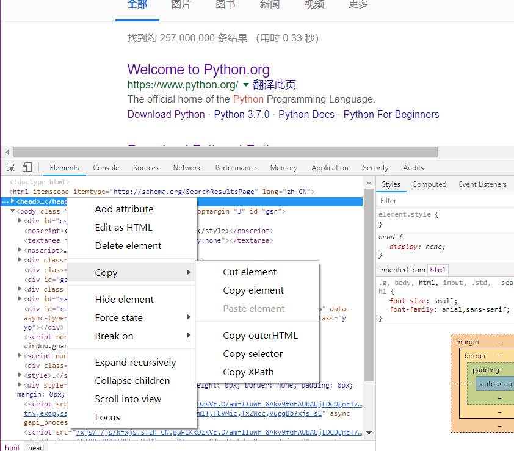

# 4.2 使用Beautiful Soup

## 1.说明

BeautifulSoup 就是 Python 的一个 HTML 或 XML 的解析库，我们可以用它来方便地从网页中提取数据

## 2. 解析器 {#3-解析器}

BeautifulSoup 支持的解析器及优缺点

| 解析器 | 使用方法 | 优势 | 劣势 |
| :--- | :--- | :--- | :--- |
| Python标准库 | BeautifulSoup\(markup, "html.parser"\) | Python的内置标准库、执行速度适中 、文档容错能力强 | Python 2.7.3 or 3.2.2\)前的版本中文容错能力差 |
| LXML HTML 解析器 | BeautifulSoup\(markup, "lxml"\) | 速度快、文档容错能力强 | 需要安装C语言库 |
| LXML XML 解析器 | BeautifulSoup\(markup, "xml"\) | 速度快、唯一支持XML的解析器 | 需要安装C语言库 |
| html5lib | BeautifulSoup\(markup, "html5lib"\) | 最好的容错性、以浏览器的方式解析文档、生成 HTML5 格式的文档 | 速度慢、不依赖外部扩展 |

## 3.基本使用

实例:

```text
html = """
<html><head><title>The Dormouse's story</title></head>
<body>
<p class="title" name="dromouse"><b>The Dormouse's story</b></p>
<p class="story">Once upon a time there were three little sisters; and their names were
<a href="http://example.com/elsie" class="sister" id="link1"><!-- Elsie --></a>,
<a href="http://example.com/lacie" class="sister" id="link2">Lacie</a> and
<a href="http://example.com/tillie" class="sister" id="link3">Tillie</a>;
and they lived at the bottom of a well.</p>
<p class="story">...</p>
"""

from bs4 import BeautifulSoup
soup = BeautifulSoup(html,'lxml')
print(soup.prettify())
print(soup.title.string)
```

运行结果:

```text
<html>
 <head>
  <title>
   The Dormouse's story
  </title>
 </head>
 <body>
  <p class="title" name="dromouse">
   <b>
    The Dormouse's story
   </b>
  </p>
  <p class="story">
   Once upon a time there were three little sisters; and their names were
   <a class="sister" href="http://example.com/elsie" id="link1">
    <!-- Elsie -->
   </a>
   ,
   <a class="sister" href="http://example.com/lacie" id="link2">
    Lacie
   </a>
   and
   <a class="sister" href="http://example.com/tillie" id="link3">
    Tillie
   </a>
   ;
and they lived at the bottom of a well.
  </p>
  <p class="story">
   ...
  </p>
 </body>
</html>
The Dormouse's story
```

* prettify\(\):把要解析的字符串以标准的缩进格式输出
* soup.title.string:选择HTML中的title节点，再调用string属性得到里面的文本

## 4. 节点选择器 {#5-节点选择器}

### 选择元素

例子:

```text
html = """
<html><head><title>The Dormouse's story</title></head>
<body>
<p class="title" name="dromouse"><b>The Dormouse's story</b></p>
<p class="story">Once upon a time there were three little sisters; and their names were
<a href="http://example.com/elsie" class="sister" id="link1"><!-- Elsie --></a>,
<a href="http://example.com/lacie" class="sister" id="link2">Lacie</a> and
<a href="http://example.com/tillie" class="sister" id="link3">Tillie</a>;
and they lived at the bottom of a well.</p>
<p class="story">...</p>
"""
from bs4 import BeautifulSoup
soup = BeautifulSoup(html, 'lxml')
print(soup.title)
print(type(soup.title))
print(soup.title.string)
print(soup.head)
# 只能选择第一个p节点
print(soup.p)
```

运行结果：

```text
<title>The Dormouse's story</title>
<class 'bs4.element.Tag'>
The Dormouse's story
<head><title>The Dormouse's story</title></head>
<p class="title" name="dromouse"><b>The Dormouse's story</b></p>
```

### 提取信息 {#提取信息}

#### 获取名称 {#获取名称}

可以利用 name 属性来获取节点的名称

实例:选择title，调用name属性得到节点的名称

```text
print(soup.title.name)
```

运行结果:

```text
title
```

#### 获取属性 {#获取属性}

调用 attrs 获取所有属性

```text
# 返回字典
print(soup.p.attrs)
print(soup.p.attrs['name'])
```

运行结果:

```text
{'class': ['title'], 'name': 'dromouse'}
dromouse
```

#### 获取内容 {#获取内容}

利用 string 属性获取节点元素包含的文本内容

```text
print(soup.p.string)
```

运行结果:

```text
The Dormouse's story
```

### 嵌套选择 {#嵌套选择}

实例：获取head节点内部的title节点

```text
html = """
<html><head><title>The Dormouse's story</title></head>
<body>
"""
from bs4 import BeautifulSoup
soup = BeautifulSoup(html, 'lxml')
print(soup.head.title)
print(type(soup.head.title))
print(soup.head.title.string)
```

运行结果:

```text
<title>The Dormouse's story</title>
<class 'bs4.element.Tag'>
The Dormouse's story
```

### 关联选择 {#关联选择}

#### 子节点和子孙节点 {#子节点和子孙节点}

获取直接子节点可以调用 contents 属性

实例:获取body节点下子节点p

```text
html = """
<html>
    <head>
        <title>The Dormouse's story</title>
    </head>
    <body>
        <p class="story">
            Once upon a time there were three little sisters; and their names were
            <a href="http://example.com/elsie" class="sister" id="link1">
                <span>Elsie</span>
            </a>
            <a href="http://example.com/lacie" class="sister" id="link2">Lacie</a> 
            and
            <a href="http://example.com/tillie" class="sister" id="link3">Tillie</a>
            and they lived at the bottom of a well.
        </p>
        <p class="story">...</p>
"""

from bs4 import  BeautifulSoup

soup = BeautifulSoup(html,'lxml')
print(soup.body.contents)
```

运行结果:返回结果是列表形式

```text
['\n', <p class="story">
            Once upon a time there were three little sisters; and their names were
            <a class="sister" href="http://example.com/elsie" id="link1">
<span>Elsie</span>
</a>
<a class="sister" href="http://example.com/lacie" id="link2">Lacie</a> 
            and
            <a class="sister" href="http://example.com/tillie" id="link3">Tillie</a>
            and they lived at the bottom of a well.
        </p>, '\n', <p class="story">...</p>, '\n']
```

可以调用 children 属性，得到相应的结果:

```text
from bs4 import BeautifulSoup

soup = BeautifulSoup(html,'lxml')
print(soup.body.children)
for i,child in enumerate(soup.body.children):
    print(i,child)
```

运行结果:

```text
<list_iterator object at 0x00000217D33CD048>
0 

1 <p class="story">
            Once upon a time there were three little sisters; and their names were
            <a class="sister" href="http://example.com/elsie" id="link1">
<span>Elsie</span>
</a>
<a class="sister" href="http://example.com/lacie" id="link2">Lacie</a> 
            and
            <a class="sister" href="http://example.com/tillie" id="link3">Tillie</a>
            and they lived at the bottom of a well.
        </p>
2 

3 <p class="story">...</p>
4
```

要得到所有的子孙节点的话可以调用 descendants 属性

```text
from bs4 import BeautifulSoup

soup = BeautifulSoup(html,'lxml')
print(soup.body.descendants)
for i,child in enumerate(soup.body.descendants):
    print(i,child)
```

运行结果:

```text
<generator object descendants at 0x0000014D106353B8>
0 

1 <p class="story">
            Once upon a time there were three little sisters; and their names were
            <a class="sister" href="http://example.com/elsie" id="link1">
<span>Elsie</span>
</a>
<a class="sister" href="http://example.com/lacie" id="link2">Lacie</a> 
            and
            <a class="sister" href="http://example.com/tillie" id="link3">Tillie</a>
            and they lived at the bottom of a well.
        </p>
2 
            Once upon a time there were three little sisters; and their names were

3 <a class="sister" href="http://example.com/elsie" id="link1">
<span>Elsie</span>
</a>
4 

5 <span>Elsie</span>
6 Elsie
7 

8 

9 <a class="sister" href="http://example.com/lacie" id="link2">Lacie</a>
10 Lacie
11  
            and

12 <a class="sister" href="http://example.com/tillie" id="link3">Tillie</a>
13 Tillie
14 
            and they lived at the bottom of a well.

15 

16 <p class="story">...</p>
17 ...
18
```

#### 父节点和祖先节点 {#父节点和祖先节点}

要获取某个节点元素的父节点，可以调用 parent 属性：

实例:获取节点a的父节点p下的内容

```text
html = """
<html>
    <head>
        <title>The Dormouse's story</title>
    </head>
    <body>
        <p class="story">
            Once upon a time there were three little sisters; and their names were
            <a href="http://example.com/elsie" class="sister" id="link1">
                <span>Elsie</span>
            </a>
        </p>
        <p class="story">...</p>
"""

from bs4 import BeautifulSoup
soup = BeautifulSoup(html,'lxml')
print(soup.a.parent)
```

运行结果:

```text
<p class="story">
            Once upon a time there were three little sisters; and their names were
            <a class="sister" href="http://example.com/elsie" id="link1">
<span>Elsie</span>
</a>
</p>
```

要想获取所有的祖先节点，可以调用 parents 属性

```text
html = """
<html>
    <body>
        <p class="story">
            <a href="http://example.com/elsie" class="sister" id="link1">
                <span>Elsie</span>
            </a>
        </p>
"""

from bs4 import BeautifulSoup
soup = BeautifulSoup(html,'lxml')
print(type(soup.a.parents))
print(list(enumerate(soup.a.parents)))
```

运行结果:

```text
<class 'generator'>
[(0, <p class="story">
<a class="sister" href="http://example.com/elsie" id="link1">
<span>Elsie</span>
</a>
</p>), (1, <body>
<p class="story">
<a class="sister" href="http://example.com/elsie" id="link1">
<span>Elsie</span>
</a>
</p>
</body>), (2, <html>
<body>
<p class="story">
<a class="sister" href="http://example.com/elsie" id="link1">
<span>Elsie</span>
</a>
</p>
</body></html>), (3, <html>
<body>
<p class="story">
<a class="sister" href="http://example.com/elsie" id="link1">
<span>Elsie</span>
</a>
</p>
</body></html>)]
```

#### 兄弟节点 {#兄弟节点}

* next\_sibling :获取节点的下一个兄弟节点
* previous\_sibling:获取节点上一个兄弟节点
* next\_siblings :返回所有前面兄弟节点的生成器
* previous\_siblings :返回所有后面的兄弟节点的生成器

实例:

```text
html = """
<html>
    <body>
        <p class="story">
            Once upon a time there were three little sisters; and their names were
            <a href="http://example.com/elsie" class="sister" id="link1">
                <span>Elsie</span>
            </a>
            Hello
            <a href="http://example.com/lacie" class="sister" id="link2">Lacie</a> 
            and
            <a href="http://example.com/tillie" class="sister" id="link3">Tillie</a>
            and they lived at the bottom of a well.
        </p>
"""

from bs4 import BeautifulSoup

soup = BeautifulSoup(html,'lxml')
print('next sibling:',soup.a.next_sibling)
print('previous sibling:',soup.a.previous_sibling)
print("next siblings:",list(soup.a.next_siblings))
print("previouos siblings:",list(soup.a.previous_siblings))
```

运行结果:

```text
next sibling: 
            Hello

previous sibling: 
            Once upon a time there were three little sisters; and their names were

next siblings: ['\n            Hello\n            ', <a class="sister" href="http://example.com/lacie" id="link2">Lacie</a>, ' \n            and\n            ', <a class="sister" href="http://example.com/tillie" id="link3">Tillie</a>, '\n            and they lived at the bottom of a well.\n        ']
previouos siblings: ['\n            Once upon a time there were three little sisters; and their names were\n            ']
```

#### 提取信息 {#提取信息}

获取一些信息，比如文本、属性等等

```text
html = """
<html>
    <body>
        <p class="story">
            Once upon a time there were three little sisters; and their names were
            <a href="http://example.com/elsie" class="sister" id="link1">Bob</a><a href="http://example.com/lacie" class="sister" id="link2">Lacie</a> 
        </p>
"""
from bs4 import BeautifulSoup
soup = BeautifulSoup(html, 'lxml')
print('Next Sibling:')
print(type(soup.a.next_sibling))
print(soup.a.next_sibling)
print(soup.a.next_sibling.string)
print('Parent:')
print(type(soup.a.parents))
print(list(soup.a.parents)[0])
print(list(soup.a.parents)[0].attrs['class'])
```

运行结果:

```text
Next Sibling:
<class 'bs4.element.Tag'>
<a class="sister" href="http://example.com/lacie" id="link2">Lacie</a>
Lacie
Parent:
<class 'generator'>
<p class="story">
            Once upon a time there were three little sisters; and their names were
            <a class="sister" href="http://example.com/elsie" id="link1">Bob</a><a class="sister" href="http://example.com/lacie" id="link2">Lacie</a>
</p>
['story']
```

## 5. 方法选择器 {#6-方法选择器}

常用查询方法:find\_all\(\)、find\(\)

### find\_all\(\) {#findall}

查询所有符合条件的元素

语法:

```text
find_all(name , attrs , recursive , text , **kwargs)
```

#### name {#name}

根据节点名来查询元素

```text
html='''
<div class="panel">
    <div class="panel-heading">
        <h4>Hello</h4>
    </div>
    <div class="panel-body">
        <ul class="list" id="list-1">
            <li class="element">Foo</li>
            <li class="element">Bar</li>
            <li class="element">Jay</li>
        </ul>
        <ul class="list list-small" id="list-2">
            <li class="element">Foo</li>
            <li class="element">Bar</li>
        </ul>
    </div>
</div>
'''

from bs4 import BeautifulSoup

soup = BeautifulSoup(html,'lxml')
print(soup.find_all(name='ul'))
print(type(soup.find_all(name='ul')[0]))
```

运行结果:返回结果类型为:bs4.element.Tag

```text
[<ul class="list" id="list-1">
<li class="element">Foo</li>
<li class="element">Bar</li>
<li class="element">Jay</li>
</ul>, <ul class="list list-small" id="list-2">
<li class="element">Foo</li>
<li class="element">Bar</li>
</ul>]
<class 'bs4.element.Tag'>
```

获取ul下的li节点以及li下的文本内容

```text
from bs4 import BeautifulSoup

soup = BeautifulSoup(html,'lxml')
# print(soup.find_all(name='ul'))
# print(type(soup.find_all(name='ul')[0]))
for ul in soup.find_all(name='ul'):
    print(ul.find_all(name='li'))
    for li in ul.find_all(name='li'):
        print(li.string)
```

运行结果:

```text
[<li class="element">Foo</li>, <li class="element">Bar</li>, <li class="element">Jay</li>]
Foo
Bar
Jay
[<li class="element">Foo</li>, <li class="element">Bar</li>]
Foo
Bar
```

#### attrs {#attrs}

根据属性来进行查询

```text
html='''
<div class="panel">
    <div class="panel-heading">
        <h4>Hello</h4>
    </div>
    <div class="panel-body">
        <ul class="list" id="list-1" name="elements">
            <li class="element">Foo</li>
            <li class="element">Bar</li>
            <li class="element">Jay</li>
        </ul>
        <ul class="list list-small" id="list-2">
            <li class="element">Foo</li>
            <li class="element">Bar</li>
        </ul>
    </div>
</div>
'''

from bs4 import BeautifulSoup

soup = BeautifulSoup(html,'lxml')
# 查询属性以字典的的进行查询
print(soup.find_all(attrs={'id':'list-1'}))
print(soup.find_all(attrs={"name":"elements"}))
```

运行结果:

```text
[<ul class="list" id="list-1" name="elements">
<li class="element">Foo</li>
<li class="element">Bar</li>
<li class="element">Jay</li>
</ul>]
[<ul class="list" id="list-1" name="elements">
<li class="element">Foo</li>
<li class="element">Bar</li>
<li class="element">Jay</li>
</ul>]
```

对于常用的属性比如id，class，可以不用attrs传递

```text
from bs4 import BeautifulSoup
soup = BeautifulSoup(html, 'lxml')
print(soup.find_all(id='list-1'))
# 由于class是关键字需要添加下划线区分
print(soup.find_all(class_='element'))
```

运行结果:

```text
[<ul class="list" id="list-1">
<li class="element">Foo</li>
<li class="element">Bar</li>
<li class="element">Jay</li>
</ul>]
[<li class="element">Foo</li>, <li class="element">Bar</li>, <li class="element">Jay</li>, <li class="element">Foo</li>, <li class="element">Bar</li>]
```

#### text {#text}

text 参数可以用来匹配节点的文本，传入的形式可以是字符串，可以是正则表达式对象

```text
html='''
<div class="panel">
    <div class="panel-body">
        <a>Hello, this is a link</a>
        <a>Hello, this is a link, too</a>
    </div>
</div>
'''
import re
from bs4 import BeautifulSoup

soup = BeautifulSoup(html,'lxml')
# 查询文本包含有link的文本
print(soup.find_all(text=re.compile('link')))
```

运行结果:

```text
['Hello, this is a link', 'Hello, this is a link, too']
```

### find\(\) {#find}

find\(\) 方法返回的是单个元素，即第一个匹配的元素，而 find\_all\(\) 返回的是所有匹配的元素组成的列表

```text
html='''
<div class="panel">
    <div class="panel-body">
        <a class='element'>Hello, this is a link</a>
        <a class='element'>Hello, this is a link, too</a>
    </div>
</div>
'''

from bs4 import BeautifulSoup

soup = BeautifulSoup(html,'lxml')
print(soup.find(name='a'))
print(soup.find(attrs={'class':'element'}))
print(soup.find(class_='element'))
print(type(soup.find(name='a')))
```

返回结果:返回类型为&lt;class 'bs4.element.Tag'&gt;

```text
<a class="element">Hello, this is a link</a>
<a class="element">Hello, this is a link</a>
<a class="element">Hello, this is a link</a>
<class 'bs4.element.Tag'>
```

其他查询方法

### find\_parents\(\) find\_parent\(\) {#findparents-findparent}

find\_parents\(\) 返回所有祖先节点，find\_parent\(\) 返回直接父节点。

### find\_next\_siblings\(\) find\_next\_sibling\(\) {#findnextsiblings-findnextsibling}

find\_next\_siblings\(\) 返回后面所有兄弟节点，find\_next\_sibling\(\) 返回后面第一个兄弟节点。

### find\_previous\_siblings\(\) find\_previous\_sibling\(\) {#findprevioussiblings-findprevioussibling}

find\_previous\_siblings\(\) 返回前面所有兄弟节点，find\_previous\_sibling\(\) 返回前面第一个兄弟节点。

### find\_all\_next\(\) find\_next\(\) {#findallnext-findnext}

find\_all\_next\(\) 返回节点后所有符合条件的节点, find\_next\(\) 返回第一个符合条件的节点。

### find\_all\_previous\(\) 和 find\_previous\(\) {#findallprevious-和-findprevious}

find\_all\_previous\(\) 返回节点后所有符合条件的节点, find\_previous\(\) 返回第一个符合条件的节点

## 6.CSS选择器

相关链接:[http://www.w3school.com.cn/cssref/css\_selectors.asp](http://www.w3school.com.cn/cssref/css_selectors.asp)。

使用 CSS 选择器，只需要调用 select\(\) 方法，传入相应的 CSS 选择器

实例:

```text
html='''
<div class="panel">
    <div class="panel-heading">
        <h4>Hello</h4>
    </div>
    <div class="panel-body">
        <ul class="list" id="list-1">
            <li class="element">Foo</li>
            <li class="element">Bar</li>
            <li class="element">Jay</li>
        </ul>
        <ul class="list list-small" id="list-2">
            <li class="element">Foo</li>
            <li class="element">Bar</li>
        </ul>
    </div>
</div>
'''
from bs4 import BeautifulSoup

soup = BeautifulSoup(html,'lxml')
print(soup.select('.panel .panel-heading'))
print(soup.select('ul li'))
print(soup.select('#list-2 .element'))
print(soup.select('ul')[0])
```

运行结果:

```text
[<div class="panel-heading">
<h4>Hello</h4>
</div>]
[<li class="element">Foo</li>, <li class="element">Bar</li>, <li class="element">Jay</li>, <li class="element">Foo</li>, <li class="element">Bar</li>]
[<li class="element">Foo</li>, <li class="element">Bar</li>]
<ul class="list" id="list-1">
<li class="element">Foo</li>
<li class="element">Bar</li>
<li class="element">Jay</li>
</ul>
```

### 嵌套选择 {#嵌套选择}

实例:select\(\) 方法同样支持嵌套选择，例如我们先选择所有 ul 节点，再遍历每个 ul 节点选择其 li 节点

```text
from bs4 import BeautifulSoup

soup = BeautifulSoup(html,'lxml')
for ul in soup.select('ul'):
    print(ul.select('li'))
```

运行结果:

```text
[<li class="element">Foo</li>, <li class="element">Bar</li>, <li class="element">Jay</li>]
[<li class="element">Foo</li>, <li class="element">Bar</li>]
```

### 获取属性 {#获取属性}

获取属性还是可以用上面的方法获取

```text
from bs4 import BeautifulSoup

soup = BeautifulSoup(html,'lxml')
for ul in soup.select('ul'):
    print(ul['id'])
    print(ul.attrs['id'])
```

运行结果:

```text
list-1
list-1
list-2
list-2
```

### 获取文本 {#获取文本}

获取文本可以用string 属性，还有一种方法那就是 get\_text\(\)，同样可以获取文本值。

```text
from bs4 import BeautifulSoup

soup = BeautifulSoup(html,'lxml')
for li in soup.select('li'):
    print('GET TEXT:',li.get_text())
    print('STRING:',li.string)
```

运行结果:

```text
GET TEXT: Foo
STRING: Foo
GET TEXT: Bar
STRING: Bar
GET TEXT: Jay
STRING: Jay
GET TEXT: Foo
STRING: Foo
GET TEXT: Bar
STRING: Bar
```

## 7.细节

* 推荐使用 LXML 解析库，必要时使用 html.parser
* 节点选择筛选功能弱但是速度快
* 建议使用 find\(\)、find\_all\(\) 查询匹配单个结果或者多个结果
* 如果对 CSS 选择器熟悉的话可以使用 select\(\) 选择法

如何匹配规则不是熟练，而且想快速获取，可以如下操作:


右键能手敲就手敲，不要偷懒，不然能力提升不上去

